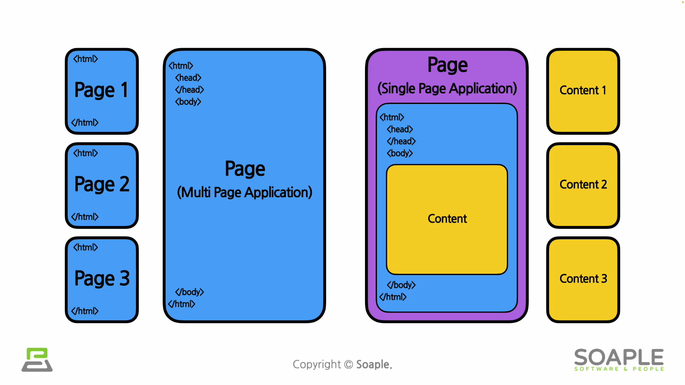

## 1주차 - 리액트 시작하기
***

### #1 HTML과 CSS

#### HTML : Hyper Text Markup Language
- **마크업**: 문서나 데이터를 처리하기 위해 문서에 추가되는 정보  
- 웹 사이트의 뼈대를 구성
```
태그
<html></html> <!-- 기본 태그 형태 -->
<br /> <!-- 닫힘 태그가 없는 경우 -->


웹사이트의 기본 태그 구조
<html>
       <head>
           <!-- 타이틀 및 메타데이터가 들어감 -->
       </head>
       <body>
           <!-- 웹 사이트의 본문 내용이 들어감 -->
       </body>
</html>
```

#### MPA & SPA



- **MPA** : 
    * 사용자가 페이지를 요청할 때마다 새로운 페이지가 로딩되는 방식
    * 각각의 html 파일을 갖고 있음 
- **SPA** : 
    * 단 하나의 페이지(html)만 갖고 있음
    * 사용자가 요청할 때마다 변화가 생기는 body부분을 동적으로 관리함

#### CSS : Cascading Style Sheets

- 웹사이트의 레이아웃, 글꼴, 색상 등의 디자인을 입히는 역할

***

### #2 JavaScript (ECMAScript)

- 스크립트 언어 - 프로그램이 실행되는 런타임에 코드가 해석됨 (컴파일x)

#### 문법

- **자료형** : 변수 선언 시가 아닌 변수에 데이터가 대입되는 시점에 형성됨 (동적 타이핑)
    - var, let
    - Number, String, Boolean, Null, Undefined, Array, Object type 이 있음
    - Object type (객체) - 키와 밸류로 이루어진 쌍의 집합
        - 키는 문자열만 가능, 밸류는 상관없음 (객체도 가능)
```
let obj = {
    a: {a1: 1, a2: 2},
    b: {b1: 3, b2: 4},
    c: {c1: 5, c2: 6},
}
<!--출력 시 .을 사용-->
console.log(obj.c.c2);
```
- **연산자(Operator)**
    - 대입연산자 (=)
    - 산술술연산자 (+, -, /, *, %, **)
        - 혼합해서 사용가능
        - a += b; -> a = a + b;
    - 증감연산자 (++, --)
        - postfix 방식: a++
        - prefix 방식: ++a
    - 비교연산자 (<, >, <=, >=)
    - 동등연산자 (==, !=) 
        - 값이 같은 지 비교
    - 일치연산자 (===, !==) 
        - 값과 자료형까지 같은 지 비교
    - 이진논리연산자 (&&, ||)
    - 삼항연산자 (조건식 ? true일 경우 : false일 경우)

- **함수**
```
<!-- function statement -->
function sum(a, b) {
    return a + b;
}

<!-- arrow function expression -->
const sum = (a, b) => {
    return a + b;
}
```
***

### #3 React

#### 리액트란?

- **리액트** : 사용자 인터페이스(UI)를 만들기 위한 자바스크립트 라이브러리  
    - 라이브러리 - 자주 사용되는 기능들을 모아놓은 것

#### 장점

- 빠른 업데이트, 렌더링 속도
    - Virtual DOM
        - DOM (Document Object Model) - 웹페이지를 정의하는 하나의 객체
        - 업데이트해야 될 최소한의 부분을 검색하고 업데이트함
- 컴포넌트의 조합으로 이루어짐
    - 재사용성
- 메타(Meta) : 큰 스폰서를 갖고 있음
- 활발한 지식공유 & 커뮤니티
    - 깃허브, 스택오버플로우 등
- 모바일 앱 개발로 이어질 수 있음 (React Native)

#### 단점

- 방대한 학습량 - 업데이트가 활발해 계속해서 새로 공부해야 할 것들이 늘어남
- 높은 상태관리 복잡도 - state관리

#### CRA

- npx : execute npm package binaries - 패키지를 설치하고 실행시켜줌줌

- 리액트 애플리케이션 생성
    - npx create-react-app <your-project-name>

- 리액트 앱 실행
    - npm start
