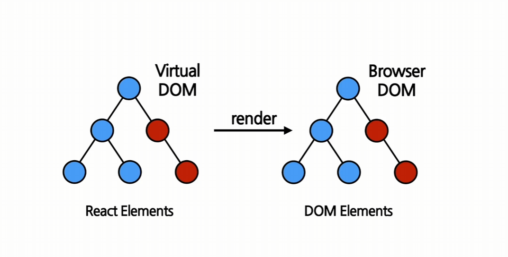
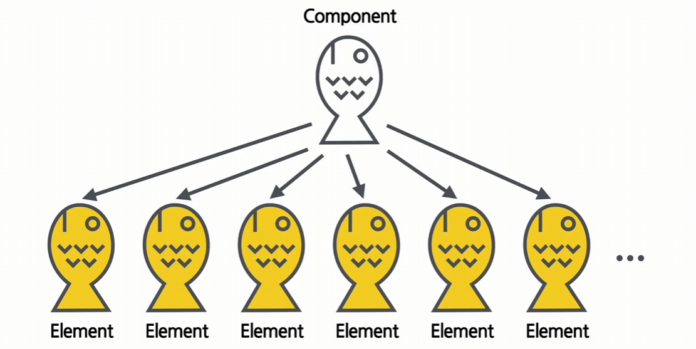
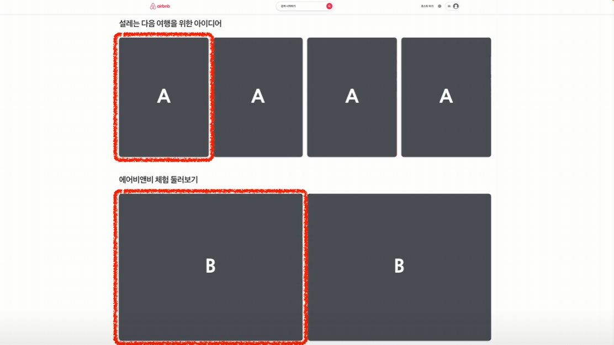
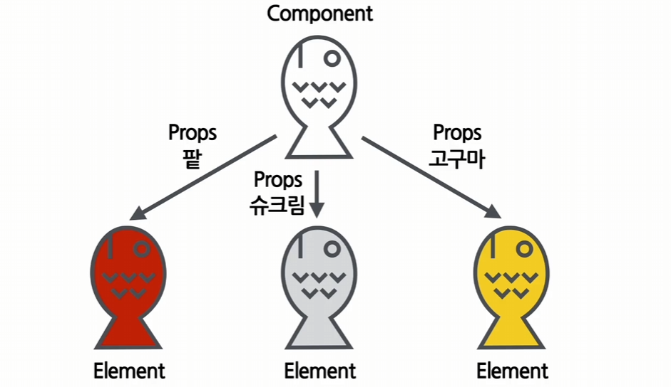
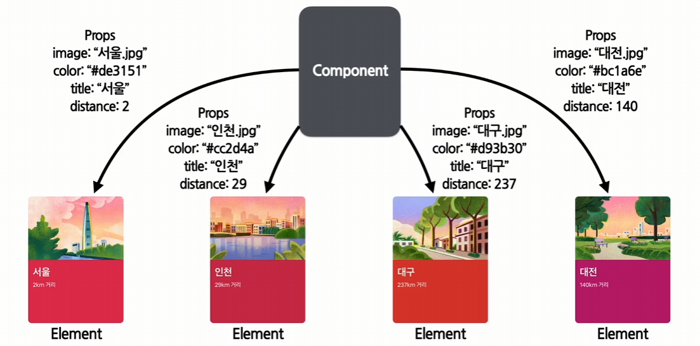
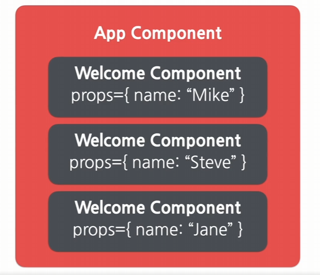
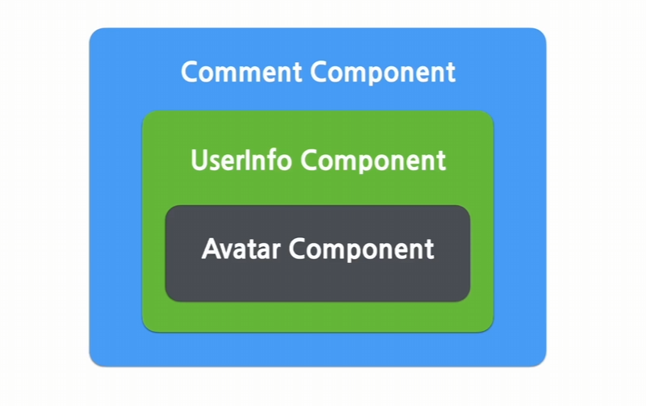

## 2주차 - JSX, Elements, Components, Props

### #1 JSX

- 자바스크립트의 확장문법 (Syntax Extension to JavaScript)
- 자바스크립트와 XML, HTML을 합친 것
- JavaScript와 Xml의 앞글자를 따서 JSX 라고 부름

#### 1. JSX의 역할

- JSX는 내부적으로 XML, HTML 코드를 JavaScript로 변환하는 과정을 거치게 됨.
- 이때 JSX 코드를 JavaScript 코드로 변환하기 위해서는 React의 createElement 함수를 사용함

```jsx
// JSX를 사용한 코드
const element = <h1 className="greeting">Hello, World!</h1>;

// JSX를 사용하지 않은 코드
const element = React.createElement("h1", { className: "greeting" }, "Hello, world!");
```

- 두개의 코드는 동일한 역할을 수행함.
- createElement 함수 호출을 통해 아래와 같은 JavaScript 객체가 나오게됨.

```jsx
const element = {
	type: "h1",
	props: {
		className: "greeting",
		children: "Hello, world!",
	},
};
```

- React는 이 객체들을 읽어서 DOM을 만드는데에 사용하고 항상 최신 상태로 유지함
- React에서는 이러한 객체들을 **element** 라고 부름

- createElement 함수 살펴보기

```JSX
React.createElement(
    type,                 // div, span, table 등등 html 태그
    [props],            // 속성
    [...children]      // 현재 엘리먼트가 포함하고있는 자식 엘리먼트
)
```

#### 2. JSX의 장점

1. 코드가 간결해진다

   ```JSX
   <div> Hello, {name}</div>

   React.createElement('div', null, `Hello, ${name}`);
   ```

   - 두 코드는 같은 역할을 하지만 jsx를 사용하지 않은 코드의 경우 createElement를 사용하고있어 코드의 길이가 더욱 길어짐

2. 가독성이 향상된다

   - 가독성은 코드 작성 뿐만 아니라 유지보수 관점에서도 굉장히 중요한 부분
   - 가독성이 높을수록 코드상에 존재하는 버그 또한 쉽게 발견할 수 있음

3. 보안성이 올라간다
   - JSX를 사용하면 인젝션 어택(Injection Attacks)이라 불리는 해킹 방법을 방어함
   - 인젝션 어택이란, 입력창에 문자나 숫자같은 일반적인 값이 아닌 소스코드를 입력하여 해당 코드가 실행되도록 만드는 해킹방법을 말함.

#### 3. JSX 사용법

- JSX는 모든 자바스크립트 문법을 지원하며, 추가로 XML과 HTML을 섞어서 사용하면 됨.
- XML/HTML 코드 중간에 JavaScript 코드를 사용하고 싶다면 {중괄호}를 사용하여 묶어주면 됨.

```JSX
const name = '성환';
const element = <h1>안녕, {name}</h1>;

ReactDOM.render(
    element,
    document,getElementById('root')
);
```

- 함수 사용

```JSX
function getGreeting(user) {
    if (user) {     // 사용자가 존재하면
        return <h1>Hello, {formatName(user)}</h1>;  // 함수를 사용하여 이름 출력
    }
    return <h1>Hello, Stranger.</h1>    // 그렇지 않을때 출력
}
```

- HTML태그에 속성 값 넣기

```JSX
// 큰따옴표 사이에 문자열 넣기
const element = <div tabIndex = "0"></div>;

// 중괄호 사이에 자바스크립트 코드 넣기
const element = </img>;
```

- 자식(children) 정의하기

```JSX
// div태그의 children은 h1 태그
const element = (
    <div>
        <h1>this is test</h1>
    </div>
)
```

---

### #2 Elements

#### 1. Elements의 정의

- Elements : 리액트 앱을 구성하는 가장 작은 블록
- 엘리먼트는 웹사이트에 대한 모든 정보를 담고있는 객체인 DOM에서 사용하는 용어 (HTML 요소들) 이를 DOM elements 라고 함
- 리액트에서는 화면에 나타나는 내용을 기술하는 자바스크립트 객체를 Virual DOM 이라고 함 (React 엘리먼트)



- 실제 브라우저의 DOM에 존재하는 엘리먼트는 DOM 엘리먼트
- React의 Virtual DOM에 존재하는 엘리먼트는 React 엘리먼트

#### 2. Elements의 생김새

- React의 createElement 함수를 사용하여 생성된 것이 리액트 엘리먼트

```JSX
const element = <h1>Hello, world!</h1>;
```

- 리액트는 이 엘리먼트를 이용해서 DOM 엘리먼트를 생성함
- React 엘리먼트의 생김새 - 자바스크립트 객체 형태로 존재함 - 컴포넌트 유형과 속성 및 내부의 모든 자식에 대한 정보를 포함하고 있는 자바스크립트 객체, 한번 생성하면 바꿀 수 없음

  ````JSX
  {
  type : 'button',
  props : {
  className : 'bg-green',
  children : {
  type : 'b',
  props : {
  children : 'Hello, element!'
  }}}
  }

      // 실제 렌더링 된 DOM 엘리먼트
      <button class='bg-green'>
          <b>
              Hello, element!
          </b>
      </button>
      ```
      - type
          -  html 태그 이름이 문자열로 들어가는 경우 엘리먼트는 해당 이름을 가진 DOM 노드를 나타냄
          - 모든 React 컴포넌트는 최종적으로는 HTML 태그를 사용하게 되어있음.
          - 그러므로 type에 HTML 태그를 사용하지 않고 React 컴포넌트를 사용할 수 있음
          ```JSX
          ex)     type : Button
          ```
      - props
          - 엘리멘트의 속성
          - HTML 태그의 클래스나 스타일 같은 속성(attributes)도 포함함
      - children
          - 해당 엘리먼트의 자식 엘리먼트들이 이 부분에 들어감

  <br>

  ````

- 예제 코드

```JSX
// Button 컴포넌트
function Button(props) {
    return (
        <button className={`bg-${props.color}`}>
            <b>{props.children}</b>
        </button>
    );
}

// ConfirmDialog 컴포넌트
function ConfirmDialog(props) {
    return (
        <div>
            <p>내용을 확인하셨으면 확인 버튼을 눌러주세요.</p>
            <Button color='green'>확인</Button>
        </div>
    );
}

// ConfirmDialog 컴포넌트의 엘리먼트 형태
const element = {
    type : 'div',
    props : {
        children : [
            {
                type : 'p',
                props : {
                    children : '내용을 확인하셨으면 확인 버튼을 눌러주세요.'
                }
            },
            {   // Button 컴포넌트
                type : 'button'
                props : {
                    className : 'bg-green',
                    children : {
                        type : 'b',
                        props : {
                            children : '확인'
                        }}}
            }
        ]
    }
}
```

#### 3. Elements의 특징 및 렌더링하기

- 리액트 엘리먼트는 불변성이라는 굉장히 중요한 특징을 가지고 있음.
- 즉, 엘리먼트 생성 후에는 Children이나 Attributes를 바꿀 수 없음
  
  - 붕어빵을 만드는 것처럼, 컴포넌트를 생성하기 전에는 붕어빵 안의 내용물을 마음껏 정할 수 있지만, 붕어빵을 구워서 엘리먼트를 만들게 되면 붕어빵안의 내용을 바꿀수는 없음
- 화면에 엘리먼트를 변경시키고싶다면 새로운 엘리먼트를 생성하여 기존 엘리먼트와 바꾸면 됨.
- 리액트를 사용하다보면 화면이 얼마나 자주 갱신되는지가 성능에 큰 영향을 미치게 됨.

##### 엘리먼트 렌더링하기

```HTML
<div id="root"></div>
```

- 모든 리액트 앱에 필수적으로 들어가는 코드
- 이 div 태그 안에 리액트 엘리먼트들이 렌더링됨.<br>
  -> 이것을 루트 DOM 노드 라고 함.
- 이 div 태그 안에 있는 모든 것이 React DOM 에 의해서 관리됨.

예제코드

```JSX
function tick() {
    const element = (
        <div>
            <h1>안녕, 리액트!</h1>
            <h2>현재 시간 : {new Date().toLocaleTimeString()}</h2>
        </div>
    );
    ReactDOM.render(element, document.getElementById('root'));
}
setInterval(tick, 1000);
```

- tick 함수는 현재 시간을 포함하고 있는 엘리먼트를 생성하여 root에 렌더링함.
- setInterval 함수를 사용해서 tick 함수를 1000ms 마다 호출함
- 이때 페이지에는 매 초마다 새로운 시간이 나오게 되며, 이때 기존 엘리먼트를 변경하는것이 아닌, 새롭게 생성된 엘리먼트로 바꿔서 화면에 출력함.

---

### #3 Components와 Props

#### 1. Components

- 리액트에서는 모든 페이지가 컴포넌트로 구성되어있음
- 하나의 컴포넌트는 또 다른 여러개의 컴포넌트의 조합으로 구성될 수 있음
  
- 하나의 컴포넌트를 반복적으로 사용함으로써 개발 시간과 유지보수 비용을 줄일 수 있음
- 입력을 받고, 그에 따른 출력을 내뱉는 자바스크립트의 함수와도 비슷함
- 리액트 컴포넌트
  - props를 입력받으면 리액트 엘리먼트를 생성해줌
  - 즉, 속성을 넣으면 해당 속성에 맞춰 화면에 나타날 엘리먼트를 만들어줌
    

#### 2. props

- property의 줄임말, 리액트 컴포넌트의 속성을 뜻함
  
  - 붕어빵 안에 들어가는 재료에 따라 다른 붕어빵이 됨.
  - 이때 붕어빵에 들어가는 재료가 props
- 컴포넌트의 형태는 동일하지만 색상, 글자 등과 같은 구체적인 부분은 다를 수 있음
  
  - 배경이미지, 배경색, 제목, 거리 등을 props를 통해 컴포넌트에 전달함

#### 3. Props의 특징

- 값을 읽기만 가능함 (read-only)
- 엘리먼트를 생성하는 도중에 값이 바꿀수 없기 때문에 다른 값으로 엘리먼트를 생성하려면 새로운 값을 가진 Props를 컴포넌트에 전달하여 새로 엘리먼트를 생성해야함 (이 과정에서 엘리먼트가 다시 렌더링)

```JSX
//pure 함수
function sum(a, b) {
    return a + b;
}

// impure 함수
function withdraw(accout, amount) {
    account.total -= amount;
}
```

- 리액트 컴포넌트는 Props를 직접 바꿀 수 없고, 같은 Props에 대해서는 항상 같은 결과를 보여줘야함.
- 그러므로 withdraw와 같이 Props의 값을 변경하는 함수는 사용할 수 없고, sum 함수와 같은 pure 함수로 사용해야함함

#### 4. Props 사용하기

```jsx
function App(props) {
	return <Profile name="seonghwan" introduction="Let me introduce my self" viewCount={1500} />;
}
```

- props에 값을 넣을때는 문자열 이외에 정수, 변수, 컴포넌트 등이 들어갈 경우에는 중괄호를 사용해야함.

#### 5. 리액트 컴포넌트 만들기

- 함수 컴포넌트 (Function Cmponent)
  ```jsx
  function Welcome(props) {
  	return <h1>안녕, {props.name}</h1>;
  }
  ```
  - 하나의 props 객체를 받아서 리액트 엘리먼트를 리턴하기 때문에 React 컴포넌트라고 할 수 있음
  - 이렇게 생긴 것을 함수 컴포넌트라고 부름
  - 코드가 간단한 것이 장점.
- 클래스 컴포넌트 (Class Component)
  - 함수 컴포넌트에 비해 몇가지 추가적인 기능을 가지고 있음
  ```jsx
  class Welcome extends React.Component {
  	render() {
  		return <h1>안녕, {this.props.name}</h1>;
  	}
  }
  ```
  - React의 모든 클래스 컴포넌트는 React.Component를 상속받아서 만듬.
- 컴포넌트의 이름을 지을때는 항상 대문자로 시작해야함

  ```jsx
  const element = <div/>;

  const element = <Welcome name="seonghwan">;
  ```

  - 컴포넌트를 소문자로 시작하게 되면, 리액트는 컴포넌트가 아닌 DOM 태그(HTML태그) 라고 인식하게 됨.

#### 6. 리액트 컴포넌트 렌더링하기

- 화면에 렌더링되는것은 실제로는 컴포넌트가 아닌 컴포넌트를 통해 생성된 엘리먼트

```jsx
function Welcome(props) {
	return <h1>안녕, {props.name}</h1>;
}

const element = <Welcome name="seonghwan" />;
ReactDOM.render(element, document.getElementById("root"));
```

- 리액트는 Welcome 컴포넌트에 name의 값을 props에 담아 호출하고 리액트 엘리먼트가 생성됨
- 생성된 엘리먼트는 리액트DOM을 통해 실제 DOM에 업데이트 됨.

#### 7. 컴포넌트 합성과 추출

- 컴포넌트 합성

  - 여러개의 컴포넌트를 합쳐서 하나의 컴포넌트를 만드는것

  ```jsx
  function Welcome(props) {
  	return <h1>안녕, {props.name}</h1>;
  }

  function App(props) {
  	return (
  		<div>
  			<Welcome name="Mike" />
  			<Welcome name="Steve" />
  			<Welcome name="Jane" />
  		</div>
  	);
  }

  ReactDOM.render(<App />, document.getElementById("root"));
  ```

  - App컴포넌트는 Welcome컴포넌트 3개를 포함하고 있게 됨.
    
  - 이렇게 App 컴포넌트를 루트로 하위 컴포넌트들이 존재하는 형태가 리액트로 구성된 앱의 기본적인 구조

- 컴포넌트 추출

  - 복잡한 컴포넌트르 쪼개서 여러개의 컴포넌트로 나눔
  - 잘 활용하게 되면 컴포넌트의 재사용성이 올라가게됨.
  - 컴포넌트가 작아질수록 컴포넌트이 기능과 목적이 명확해지고 props도 단순해지기 때문에 다른곳에서도 사용하기 용이함.

  예제코드

  ```jsx
  function Comment(props) {
  	return (
  		<div className="comment">
  			<div className="user-info">
  				
  				<div className="user-info-name">{props.author.name}</div>
  			</div>

  			<div className="comment-text">{props.text}</div>

  			<div className="comment-date">{formatDate(props.date)}</div>
  		</div>
  	);
  }

  // Comment 컴포넌트의 props
  props = {
  	author: {
  		name: "test",
  		avatarUrl: "https://...",
  	},
  	text: "comment",
  	date: Date.now(),
  };
  ```

  - 아바타 컴포넌트 추출하기
    ```jsx
    function Avatar(props) {
    	return ;
    }
    ```
  - 유저 정보 추출하기
    ```jsx
    function UserInfo(props) {
    	return (
    		<div className="user-info">
    			<Avatar user={props.user} />
    			<div className="user-info-name">{props.user.name}</div>
    		</div>
    	);
    }
    ```
  - 최종 코드
    ```jsx
    function Comment(props) {
    	return (
    		<div className="comment">
    			<UserInfo user={props.author} />
    			<div className="comment-text">{props.text}</div>
    			<div className="comment-date">{formatDate(props.date)}</div>
    		</div>
    	);
    }
    ```
    
  - Comment 컴포넌트가 UserInfo 컴포넌트를 포함하고 있고<br>
    UserInfo 컴포넌트가 Avatar 컴포넌트를 포함하고있는 구조
  - 컴포넌트 추출은 기능 단위, 그리고 곧바로 재사용이 가능한 형태로 추출하는것이 좋음.
