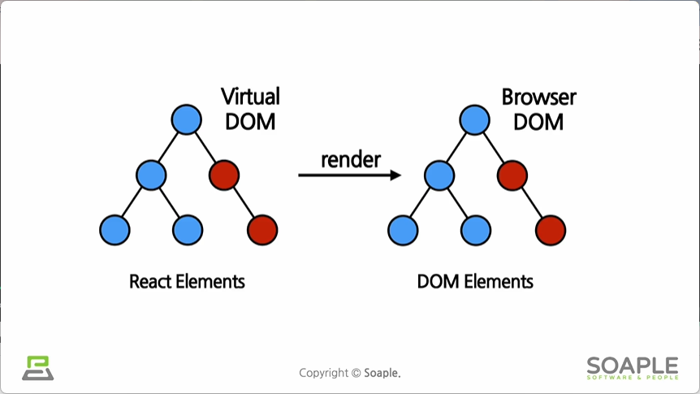

## 2주차 - JSX부터 Props까지
### #1 JSX
**JSX**란?
- JavaScript의 확장 문법
- JavaScript + HTML/XML
- ```jsx
	const element = <h1>Hello world!</h1>;
  ```

**JSX**의 역할
- HTML, XML 코드를 JS로 변환
- React.createElement()
	 ```jsx
	// jsx 사용
	return <div>Hello {this.props.toWhat}</div>;
    
    // jsx 사용X
    return React.createElement('div', null, `Hello ${this.props.toWhat}`);
    ```
	> React.createElement()의 결과로 생성된 객체 : element
	> ```jsx
	> React.createElement(
	> 	type, // html태그나 react의 컴퍼넌트 등의 유형
	> 	[props], // 속성
	> 	[...children] //현재 element가 포함하고 있는 자식 element
	> )

**JSX**의 장점
1. 코드가 간결해짐
2. 가독성이 올라감
3. Injection Attacks 방어
	- Injection Attack : 입력창에 문자나 숫자 같은 일반적인 값이 아닌 소스코드를 입력하여 해당 코드가 실행되도록 만드는 해킹 밥법


**JSX** 사용법
- { } 사용
	```jsx
    // 태그 중간에 js 추가
    function getGreeting(user) {
    	if (user) {
        	return <h1> Hello, {formatName(user)}</h1>;
        }
        return <h1> Hellom, Stanger.</h1>
    }
    
    // 태그의 속성에 값 넣기
    const element = </img>;
    ```
- children 정의
	```jsx
    const element = (
    	<div>
        	<h1>안녕하세요</h1>
            <h2>열심히 리액트를 공부해 봅시다!</h2>
        </div>
    );
    ```
    div의 children은 h1, h2
    
***

### #2 Element
**Element**란?
- Elements are the smallest building blocks of React apps.   
	리액트 앱을 구성하는 가장 작은 블록들
- 화면에 보이는 것을 기술
    
**React Element** vs **DOM Elements**   
   
- DOM Element : 실제 브라우저의 DOM에 존재하는 엘리먼트
- React Element
	- 리액트의 Virtual DOM
	- DOM Element 의 가상 표현

**Element**의 생김새
- JS 객체 형태
	```jsx
    {
    	type: 'button',
        props: {
        	className: 'bg-green',
            children: {
            	type: 'b',
                props: {
                	children: 'Hello, element!'
                }
            }
        }
    }
    
    // rendering
    <button class='bg-green'>
    	<b>
        	Hello, element!
        </b>
    </button>
    ```
    
**Element**의 특징
- immutable (불변성)
	- im (부정) + mutable (변할 수 있는) 
	- Elements **생성 후**에는 children이나 attributes를 바꿀 수 없다
	- 기존 엘리먼트를 수정하는 것이 아니라 새로 만들어서 바꿔치기함

**rendering**

- ```jsx
  function tick() {
      const element = (
          <div>
           	  <h1> 안녕, 리액트! </h1>
              <h2> 현재 시간 : {new Date().toLocaleTimeString()}</h2>
          </div>
      );
            
      ReactDOM.render(element, document.getElementById('root'));
  }
  setInterval(tick, 1000);
  ```
  tick 함수는 현재 시간을 포함한 엘리먼트를 생성하여 root에 렌더링  
  setInterval 함수로 1초마다 tick함수를 호출
  - 매초마다 새로운 element로 바꿔치기

***

### #3 Components and Props


**Component**
- 리액트에서는 모든 페이지가 컴포넌트로 구성   
- 하나의 컴포넌트는 또 다른 여러 개의 컴포넌트로 구성 될 수 있음
- 붕어빵 틀
- 속성들을 입력 받아 그에 맞는 리액트 element를 생성하여 return


**Props**
- Property (속성)
- 컴포넌트에 전달할 다양한 정보를 담고 있는 JS 객체
- 붕어빵 재료


#### #3.1 Props
**props**의 특징
- read-only - 값 변경 불가

**props** 사용법
- JSX 사용
	```jsx
    function App(props) {
    	return (
        	<Profile
            	name="소플"
                introduction="안녕하세요, 소플입니다."
                viewCount={1500}
            />
        );
    }
    ```
- JSX 사용X
	```jsx
    React.createElement(
    	Profile,
        {
            name="소플"
            introduction="안녕하세요, 소플입니다."
            viewCount={1500}
        },
        null
    );
    ```
    
    
#### #3.2 Component


**Function Component** 와 **Class Component**
- Function Component
	```jsx
	function Welcome(pros) {
		return <h1> 안녕, {props.name}</h1>;
	}
    ```

- Class Component
	```jsx
    class Welcome extends React.Component {
    	render() {
        	return <h1> 안녕, {props.name}</h1>;
        }
    }
    ```
	React.Component를 상속
    
**Component** 만들기
- 이름은 항상 대문자로 시작 - DOM 태그와 구별

**Component** 렌더링
- component는 붕어빵 틀의 역할이기 때문에 component가 직접 렌더링되지 않음
- 컴퍼넌트를 통해 만들어진 엘리먼트가 렌더링됨
- ```jsx
  function Welcome(props) {
      return <h1> 안녕, {props.name}</h1>;
  }
  
  const element = <Welcome name="인제" />;
  ReactDOM.render(
      eleement,
      document.getElementById('root')
  );
  ```
  
**Component** 합성
- 여러 개의 컴포넌트를 합쳐서 또 다른 컴포넌트를 만드는 것
- ```jsx
  return(
  	<div>
    	<Welcome name="Mike" />
        <Welcome name="Steve" />
        <Welcome name="Jane" />
    </div>
  )
  ```
**Component** 추출
-  복잡한 컴포넌트를 쪼개서 여러 개의 컴포넌트로 나누는 것
-  재사용성과 개발 속도 향상
- 추출 예시
  ```jsx
  function Comment(props) {
  	return (
    	<div className="comment> 
        	<div className="user-info">
            	
                <div className="user-info-name">
                	{props.author.name}
                </div>
                
                <div className="comment-text">
                	{props.text}
                </div>
                
                <div className="commnet-date">
                	{formatDate(props.date)}
                </div>
            </div>
        </div>
    );
  }
  ```
	1. Avatar 추출
		```jsx
    	function Avatar(props) {
    		return(
        		
        	);
    	}
        
        function Comment(props) {
            return (
                <div className="comment> 
                    <div className="user-info">
                        <Avatar user={props.author} />
                        <div className="user-info-name">
                            {props.author.name}
                        </div>

                        <div className="comment-text">
                            {props.text}
                        </div>

                        <div className="commnet-date">
                            {formatDate(props.date)}
                        </div>
                    </div>
                </div>
            );
        }
    	```
	2. 사용자 정보 부분 추출
		```jsx
        
        function Avatar(props) {
            return(
                
            );
        }
        
        function UserInfo(props) {
        	return(
            	<div className="user-info">
                	<Avatar user={props.user} />
                    <div className="user-info-name">
                    	{props.user.name}
                    </div>
                </div>
            );
        }
        
        function Comment(props) {
            return (
                <div className="comment> 
                    <UserInfo user={props.author} /> 
        			<div className="commnet-text">
                        {props.text}
                    </div>
                    <div className="commnet-date">
                        {formatDate(props.date)}
                    </div>
                </div>
            );
        }
                   
