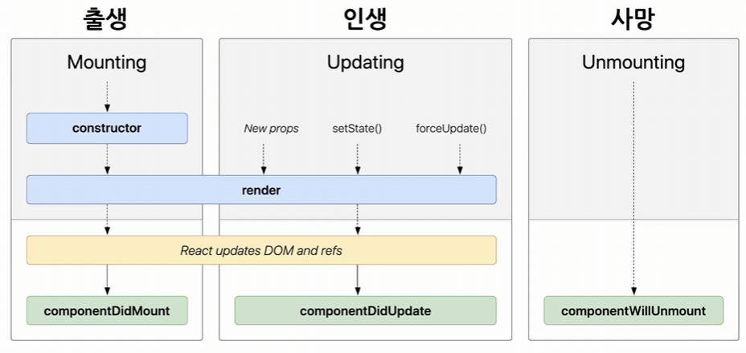

## 3주차 - State, Lifecycle, Hooks, Handing Event, Conditional Rendering

### #1 State와 Lifecycle

#### 1. State

- React 컴포넌트의 상태를 의미
- 쉽게 말하면 React 컴포넌트의 변경 가능한 데이터
- 하나의 자바스크립트 객체
  <br><br>
- State를 정의할 때 중요한 점은 렌더링이나 데이터 흐름에 사용되는 것만 State에 포함시켜야 함<br>
  - State가 변경될 경우 컴포넌트가 재렌더링<br>
  - 데이터 흐름에 관련 없는 값을 포함하면 불필요한 경우에도 컴포넌트가 재렌더링 되어 성능을 저하시킴

예제코드

```jsx
// state를 직접 수정
this.state = {
	name: "seonghwan",
};

// setState 함수를 통한 수정
this.setState({
	name: "seonghwan",
});
```

- 정의한 state는 직접 수정은 가능하지만, 컴포넌트의 렌더링과 관련이 있기 때문에 개발자 의도대로 작동하지 않을 가능성이 있음
- 그러므로 state를 변경하고자 할때는 setState 함수를 사용

#### 2. Lifecycle

- 컴포넌트의 생성되는 시점과 사라지는 시점이 정해져 있다는 의미
- 컴포넌트는 계속해서 존재하는 것이 아니라 시간의 흐름에 따라 생성, 업데이트, 삭제됨



1. 마운트
   - 컴포넌트가 생성되는 시점
   - 컴포넌트의 state를 정의, 컴포넌트가 렌더링 됨
2. 업데이트
   - 컴포넌트가 재렌더링 되는 시점
   - 컴포넌트의 props 변경, state 변경, forceUpdate 함수 호출 등
3. 언마운트
   - 현재 컴포넌트를 더이상 표시하지 않을 때

---

### #2 Hooks

#### 1. Hooks란

- 함수 컴포넌트로 클래스 컴포넌트의 기능을 모두 동일하게 구현하기 위해 사용
- 리액트의 state와 lifecycle 기능에 갈고리를 걸어 원하는 시점에 정해진 함수가 실행되도록 만든 것
- 이러한 hook의 이름은 모두 use로 시작함<br>
  `ex) useState, useEffect 등`

#### 2. useState

- state를 사용하기 위한 Hook
- 함수 컴포넌트에서는 state를 제공하지 않기 때문에 useState 훅이 필요

```jsx
import React, { useState } from "react";

function Counter(props) {
	const [count, setCount] = useState(0);

	return (
		<div>
			<p>총 {count}번 클릭했습니다</p>
			<button onClick={() => setCount(count + 1)}>증가</button>
		</div>
	);
}
```

- 버튼이 눌리면 setCount 함수를 호출하여 count를 1 증가시키고, count의 값이 변경되면 컴포넌트가 재렌더링되어 화면에 새로운 count값이 표시됨.

#### 3. useEffect

- 사이드 이펙트를 수행하기 위한 Hook
  - 다른 컴포넌트들이 렌더링이 끝난 이후에 작업을 실행하기 위해 사용
- useEffect만으로 생명 주기 함수와 동일한 기능 수행 가능<br>

`useEffect(이펙트 함수, 의존성 배열)`

- 의존성 배열 안에 있는 변수중에 하나라도 값이 변경되면, 이펙트 함수 실행
- 기본적으로 이펙트 함수는 컴포넌트가 렌더링 된 이후와 재렌더링 이후에 실행

`useEffect(이펙트 함수, [])`

- 컴포넌트가 mount, unmount시에만 이펙트 함수를 실행시키고 싶다면 빈 배열을 넣으면 됨
- 배열 생략시 컴포넌트 업데이트마다 이펙트 함수 호출

```jsx
import React, { useState, useEffect } from "react";

function Counter(props) {
	const [count, setCount] = useState(0);

	useEffect(() => {
		document.title = `you clicked ${count} times`;
	});

	return (
		<div>
			<p>총 {count}번 클릭했습니다</p>
			<button onClick={() => setCount(count + 1)}>증가</button>
		</div>
	);
}
```

#### 4. useMemo

- memoized value를 리턴하는 Hook
  - 함수 호출시 이전에 저장해 놨던 호출 결과를 바로 반환
- 컴포넌트가 재렌더링 될 때 마다 연산량이 높은 작업을 반복하는 것을 피할 수 있음

```jsx
const memoizedValue = useMemo(() => {
	return computeExpensiveValue(변수1, 변수2);
}, [변수1, 변수2]);
```

- 의존성 배열에 들어가있는 변수가 변했을 경우에만 새로 create 함수를 노출하여 결과값을 반환
- 그렇지 않을 경우 기존 함수의 결과값을 반환<br><br>
- useMemo로 전달된 함수는 렌더링이 일어나는 동안 실행 됨
  - 사이드 이펙트 같은 작업은 useMemo에서 실행되면 안됨.

#### 5. useCallback

- useMemo와 비슷하나 결과값이 아닌 함수를 반환

```jsx
const memoizedCallback = useCallback(() => {
	doSomething(변수1, 변수2);
}, [변수1, 변수2]);
```

#### 6. useRef

- 레퍼런스를 사용하기 위한 Hook
- `refObject.current` 객체를 반환함
  - 현재 레퍼런스하고 있는 엘리먼트를 의미

```jsx
const refContainer = useRef(초기값);
```

- 해당 초기값으로 초기화된 레퍼런스 객체를 반환함
- 반환된 레퍼런스 객체는 컴포넌트의 라이프사이클 전체에 걸쳐 유지(컴포넌트가 unmount 하기 전까지 계속 유지됨)

```jsx
function TextInputWithFocusButton(props) {
	const inputElem = useRef(null);

	const onButtonClick = () => {
		inputElem.current.focus();
	};

	return (
		<div>
			<input ref={inputElem} type="text"></input>
			<button onClick={onButtonClick}></button>
		</div>
	);
}
```

- 버튼 클릭시 inputElim.current를 통해 실제 엘리먼트에 접근하여 포커스 함수를 호출함

#### 7. Hook의 규칙

1. Hook은 무조건 최상위 레벨에서만 호출해야 한다
   - 반복문이나 조건문 또는 중첩된 함수들 안에서 Hook을 호출하면 안됨
   - 이렇게 해야 컴포넌트의 다수의 state를 올바르게 관리할 수 있음
2. React 함수 컴포넌트에서만 Hook을 호출해야함
   - 일반적인 JavaScript 함수에서 Hook을 호출하면 안됨.

#### 8. 커스텀 Hook

- 기본적으로 제공되는 Hook 이외에 추가적으로 필요한 기능이 있다면 직접 만들어서 사용 가능

```jsx
import React, { useState, useEffect } from "react";

function UserStatus(props) {
    const [isOnline, setIsOnline] = useState(null);

    useEffect(() => {
        function handleStatusChange(status) {
            setIsOnline(status.isOnline);
        }

        ServerAPI.subscribeUserStatus(props.user.id, handleStatusChange);
        return () +> {
            ServerAPI.unsubscribeUserStatus(props.user.id, handleStatusChange);
        };
    });

    if (isOnline === null) {
        return '대기중';
    }
    return isOnline ? '온라인' : '오프라인';
}
```

- 중복되는 코드를 추출하여 커스텀 훅으로 만들기

```jsx
import { useState, useEffect } from "react";

function useUserStatus(userId) {
    const [isOnline, setIsOnline] = useState(null);

    useEffect(() => {
        function handleStatusChange(status) {
            setIsOnline(status.isOnline);
        }

        ServerAPI.subscribeUserStatus(userId, handleStatusChange);
        return () +> {
            ServerAPI.unsubscribeUserStatus(userId, handleStatusChange);
        };
    });

    return isOnline;
}
```

- 기존 코드 변경하기

```jsx
function UserStatus(props) {
	const isOnline = useUserStatus(props.user.id);

	if (isOnline === null) {
		return "대기중";
	}
	return isOnline ? "온라인" : "오프라인";
}

function UserListItem(props) {
	const isOnline = useUserStatus(props.user.id);

	return <li>{props.user.name}</li>;
}
```

- 여러개의 컴포넌트에서 하나의 커스텀훅을 사용하더라도 컴포넌트 내부의 모든 state와 effect는 분리되어 있음

```jsx
function ChatUserSelector(props) {
	const [userId, setUserId] = useState(1);
	const isUserOnline = useUserStatus(userId);
}
```

- Hook들 사이에서 데이터를 공유하고 싶다면 위의 코드처럼 state를 다른 Hook의 파라미터로 입력하면 됨

---

### #3 Handing Event

#### 1. Event

- 버튼을 클릭하는 등 페이지에서 일어나는 하나의 사건을 이벤트 라고 함
- 이때 이벤트를 처리하는 것을 Event Handling 이라고 함

```html
DOM에서의 클릭 이벤트 처리
<button onclick="activate()"></button>

React에서의 클릭 이벤트 처리
<button onClick="{activate}"></button>
```

- DOM에서는 이벤트 처리 함수를 문자열로 전달하지만 리액트에서는 함수 그대로 전달함
- 이때 어떠한 이벤트가 발생했을때 해당 이벤트를 처리하는 함수를 `이벤트 핸들러` 라고함<br>
  (이벤트가 발생하는 것을 계속 듣고 있다는 의미로 `이벤트 리스너` 라고도 함)

- 함수 컴포넌트에서 이벤트 처리하는 방법

```jsx
function Toggle(props) {
	const [isToggleOn, setIsToggleOn] = useState(true);

	function handleClick() {
		setIsToggleOn((isToggleOn) => !isToggleOn);
	}

	const handleClick = () => {
		setIsToggleOn((isToggleOn) => !isToggleOn);
	};

	return <button onClick={handleClick}>{isToggleOn ? "켜짐" : "꺼짐"}</button>;
}
```

- 함수안에 또 다른 함수를 정의하여 이벤트 함수 생성가능
- arrow function을 사용하여 정의 가능

#### 2. 이벤트 핸들러에 arguments 전달하기

- 함수에 전달할 데이터를 `arguments` 라고 함(매개변수, 파라미터라고도 함)
- 매개변수의 순서는 변경되어도 상관 없음

```html
<button onClick={ (event) => this.deleteItem(id, event) } ></button>
```

---

### #4 Conditional Rendering

#### 1. Conditional Rendering이란

- 어떠한 조건에 따라서 렌더링이 달라지는 조건부 렌더링을 의미함<br>
  `ex) 조건문의 값이 true이면 버튼을 보여주고 false이면 버튼을 숨김`

```jsx
function UserGreeting(props) {
	return <h1>다시 오셨군요</h1>;
}

function GuestGreeting(props) {
	return <h1>회원가입 해주세요</h1>;
}

function Greeting(props) {
	const isLoggedIn = props.isLoggedIn;

	if (isLoggedIn) {
		return <UserGreeting />;
	}
	return <GuestGreeting />;
}
```

- isLoggedIn이라는 변수의 값이 true면 UserGreeting 컴포넌트를, false라면 GuestGreeting 컴포넌트를 화면에 출력함

- element variable (엘리먼트 변수)

  - 리액트의 앨리먼트를 변수처럼 다루는 방법
  - 렌더링 해야 될 컴포넌트를 변수처럼 다루고 싶을 때 사용

  ```jsx
  function LoginButton(props) {
  	return <button onClick={props.onClick}></button>;
  }
  function LogoutButton(props) {
  	return <button onClick={props.onClick}></button>;
  }

  function LoginControl(props) {
  	const [isLoggedIn, setIsLoggedIn] = useState(false);

  	const handleLoginClick = () => {
  		setIsLoggedIn(true);
  	};

  	const handleLogoutClick = () => {
  		setIsLoggedIn(false);
  	};

  	let button;
  	if (isLoggedIn) {
  		button = <LogoutButton onClick={handleLogoutClcik} />;
  	} else {
  		button = <LoginButton onClick={handleLoginClcik} />;
  	}

  	return (
  		<div>
  			<Greeting isLoggedIn={isLoggedIn} />
  			{buttton}
  		</div>
  	);
  }
  ```

  - isLoggedIn의 값에 따라서 button이라는 변수에 컴포넌트를 대입
  - 컴포넌트가 대입된 변수 button을 return에 넣어 실제로 컴포넌트가 렌더링 됨

#### 2. Inline Conditions (인라인 컨디션)

- 조건문을 코드 안에 집어넣는 것
- if문과 if-else문과 동일한 효과를 내기 위해 논리 연산자 `&&`와 `?` 사용<br>
- 리액트에서는 조건문이 true면 오른쪽에 엘리먼트가 결과값이 됨<br>
  `true && expression -> expression` `false && expression -> false`
- 삼항연산자의 경우 앞에 나오는 조건문이 true면 첫번째 항목 반환, false면 두번째 항목 반환<br>
  `condition ? true : false`
  <br><br>
- 인라인컨디션을 이용해 코드 수정

```jsx
function LoginControl(props) {
	const [isLoggedIn, setIsLoggedIn] = useState(false);

	const handleLoginClick = () => {
		setIsLoggedIn(true);
	};

	const handleLogoutClick = () => {
		setIsLoggedIn(false);
	};

	return (
		<div>
			<Greeting isLoggedIn={isLoggedIn} />
			{isLoggedIn ? <LogoutButton onClick={handleLogoutClick} /> : <LoginButton onClick={handleLoginClcik} />}
		</div>
	);
}
```

#### 3. 컴포넌트를 렌더링 하고싶지 않을 때

- null을 리턴하면 됨.

```jsx
function WarningBanner(props) {
    if (!props.warning) {
        return null;
    }
    return (
        <div>경고경고경고</div>
    );
}

function MainPage(props) {
    const [showWarning, setShowWarning] = useState(false);

    const handleToggleClick = () => {
        setShowWarning(prevShowWarning => !prevShowWarning);
    }

    return (
        <div>
            <WarningBanner warning={showWarning}/>
            <button onClick={handleToggleClick}>{showWarning ? "감추기" ; "보이기" }</button>
        </div>
    )
}
```
