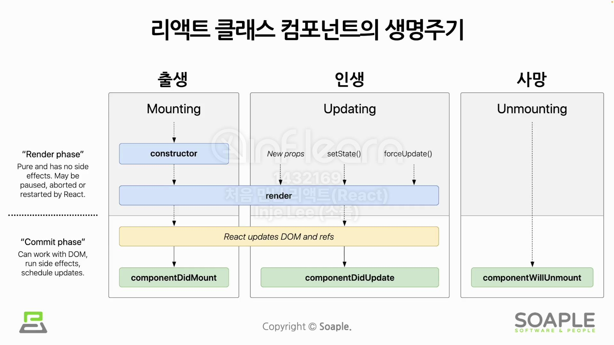

## 3주차 - State부터 Rendering까지
### #1 State와 Lifecycle
**State**
- 리액트 Component의 상태
- 리액트 Component의 **변경 가능한 데이터**
- 개발자가 직접 정의하면서 개발
- 렌더링이나 데이터 흐름에 사용되는 값만 state에 포함
- JavaScript의 객체
- 직접수정 X, **setState()** 사용 O
- ```jsx
  // state를 직접 수정 (잘못된 사용법)
  this.state = {
  	name = 'Inje'
  };
  // setState 함수를 통한 수정 (정상적인 사용법)
  this.setState({
  	name: 'Inje'
  });
  ```

**Lifecycle**
- 리액트 Component의 생명주기

  
  - mounting : 
  	- constructor(생성자)가 실행됨
  	- component 정의
  - updating :
    - 여러 번 렌더링되며 변화(update)하는 단계
    - 컴포넌트의 props 변경, setState()의 호출, forceUpdate()에 의한 강제 업데이트
  - unmounting :
    - 상위 컴포넌트에서 현재 컴포넌트를 화면에 표시하지 않게 될 때
- component는 시간의 흐름에 따라 생성되고 업데이트 되다가 사라진다. (생명주기를 가지고 있다)
***

### #2 Hooks
**Hooks**
- 함수 Component에서 클래스 Component의 state나 lifecycle 등의 기능을 사용하기 위한 개념
- state, lifecycle, 최적화 관련 함수들
- use로 시작함
  
**Hook**의 종류
- useState()
  - state를 사용하기 위한 Hook
  - ```jsx
    const [변수명, set함수명] = useState(초기값);
    ```
  - ```jsx
    function Counter(props) {
    	const [count, setCount] = useState(0);
        
        return (
        	<div>
            	<p>총 {count}번 클릭했습니다.</p>
                <button onClick={() => setCount(count + 1)}> // count값을 변경하고 재렌더링까지 해줌
                	클릭
                </button>
            </div>
        );
    }
    ```
- useEffect()
  - Side Effect(효과, 영향)를 수행하기 위한 Hook
  - 생명주기 함수들과 비슷한 작업을 수행함
  - ```jsx
    useEffect(이펙트 함수, 의존성 배열);
    // 이펙트 함수가 mount, unmount시에 단 한 번씩만 실행되게 하려면 의존성 배열에 빈 배열[] 입력
    ```
  - ```jsx
    useEffect(() => {
    	// 컴포넌트가 마운트 된 이후,
        // 의존성 배열에 있는 변수들 중 하나라도 값이 변경되었을 때 실행됨
        // 의존성 배열에 빈 배열([])을 넣으면 마운트와 언마운트시에 한 번씩만 실행됨
        // 의존성 배열 생략 시 컴포넌트 업데이트 시마다 실행됨
        
        return () => {
        	// 컴포넌트가 마운트 해제되기 전에 실행됨
        }
    }, [의존성 변수1, 의존성 변수2, ...]);
    ```
  - ```jsx
    function Counter(props) {
    	const [count, setCount] = useState(0);
        
        // componentDidMount, componentDidUpdate와 비슷하게 작동합니다.
        useEffect(() => {
        	// 브라우저 API를 사용해서 document의 title을 업데이트 합니다.
            document.title = `You clicked ${count} times`;
        }); // 의존성 배열을 생략 : 컴포넌트가 update될 때마다 실행.
        
        return (
        	<div>
            	<p>총 {count}번 클릭했습니다.</p>
                <button onClick={() => setCount(count + 1)}> // count값을 변경하고 재렌더링까지 해줌
                	클릭
                </button>
            </div>
        );
    }
    ```
- useMemo()
  - Memoized value를 리턴
    - Memoized value : Memoization의 결과 값
      - 많이 이용하는 함수의 호출 결과를 따로 저장해두었다가 다시 호출 되었을 때 저장해두었던 결과를 바로 반환
      - 불필요한 중복연산 X
  - ```jsx
    const memoizedValue = useMemo(
    	() => {
        	return computeExpensiveValue(의존성 변수1, 의존성 변수2);
        }, [의존성 변수1, 의존성 변수2]
    );
    // 의존성 배열을 넣지 않을 경우, 매 렌더링마다 함수 실행 -> 아무런 의미 없음
    // 의존성 배열이 빈 배열일 경우, 컴포넌트 마운트 시에만 호출 됨 -> 마운트 이후 변수 변경 불가
    ```

- useCallback()
  - useMemo()와 비슷, 값이 아닌 함수를 반환
  - ```jsx
    const memoizedCallback = useCallback(
    	() => {
        	doSomething(의존성 변수1, 의존성 변수2);
        },
        [의존성 변수1, 의존성 변수2]
    );
    ```
  - 부모 컴퍼넌트가 재렌더링 될 때마다 매번 자식 컴퍼넌트의 함수가 쓸 데 없이 새로 정의되는 것을 방지하기 위해 사용

- useRef()
  - Reference를 사용하기 위한 Hook
    - reference : 특정 컴포넌트에 접근할 수 있는 객체
  - ```jsx
    const refContainer = useRef(초기값);
    ```
  - ```jsx
    function TextInputWithFocusButton(props) {
        const inputElem = useRef(null);
        
        const handleFocus = () => {
            inputElem.current.focus(); // input창에 focus
        };

        return (
            <div>
                <input ref={inputElem} type="text" placeholder="Type here..." />
                <button onClick={handleFocus}>Focus Input</button>
            </div>
        );
    }
    ```
    
**Hook**의 규칙
1. **최상위** 레벨에서만 호출해야 한다.
   - 컴포넌트가 렌더링될 때마다 매번 같은 순서로 호출되어야 한다.
   - 조건문의 조건 결과에 따라 실행이 되고 안되고 하면 안됨.
2. **리액트 함수 컴포넌트**에서만 Hook을 호출해야 한다.
- eslint-plugin-react-hooks : hook의 규칙을 강제해주는 플러그인

**Custom Hook** 만들기
- 반복 사용되는 코드를 하나의 함수로 만드는 것과 비슷
- 함수명 앞에 use를 붙임으로써 hook을 사용함을 표시함
- ```jsx
  function useUserStatus(userId) {
  	const [isOnline, setIsOnline] = useState(null);
    
    useEffect(() => {
    	function handleStatusChange(status) {
        	setIsOnline(status.isOnline);
        }
        
        ServerAPI.subscribeUserStatus(userId, handleStatusChange);
        return () => {
        	ServerAPI.unsubscribeUserStatus(userId, handleStatusChange);
        };
    });
    
    return isOnline;
  }
  ```

**Custom Hook** 사용하기
- ```jsx
  function UserStatus(props) {
  	const isOnline = useUserStatus(props.user.id);
    
    if(isOnline === null) {
    	return '대기중...';
    }
    return isOnline ? '온라인' : '오프라인';
  }
  
  function UserListItem(props) {
  	const isOnline = useUserStatus(props.user.id);
    
    return (
    	<li style={{ color: isOnline ? 'green':'black' }}>
        	{props.user.name}
        </li>
    );
  }
  ```

**Hook** 사이에서 데이터 공유하기
- ```jsx
  function ChatUserSelector(props) {
  	const [userId, setUserId] = useState(1);
    const isUserOnline = useUserStatus(userId);
    // useUserStatus()의 변수로 useState()로 선언한 변수를 넣어줌으로써 Hook들간의 데이터 공유가 이뤄짐
    
    //생략
  }
  ```
***
### #3 Events

**Event**
- 사건을 의미
  - 사용자가 **버튼을 클릭**한 사건 -> **버튼 클릭 이벤트**
- camelCase 사용

**Event Handler**
- 이벤트를 관리하는 함수
- **Event Listener**라고도 함

- ```jsx
  function Toggle(props) {
  	const [istoggleOn, setIsToggleOn] = useState(true);
    
    // 방법1. 함수 안에 함수로 정의
    function handleClick() {
    	setIsToggleOn((isToggleOn) => !isToggleOn);
    }
    
    // 방법2. arrow function을 사용
    const handleClick = () => {
    	setIsToggleOn((isToggleOn) => !isToggleOn);
    }
    
    return (
    	<button onClick={handleClick}>
        	{isToggleOn ? "켜짐" : "꺼짐"}
        </button>
    );
  }
  ```
- **Arguments** 전달하기
  - 함수에 주장할 내용
  - 함수에 전달할 데이터
  - Event Handler에 전달할 데이터
  - **Parameter**(매개변수)
  - ```jsx
    function MyButton(props) {
    	const handleDelete = (id, event) => {
        	console.log(id, event.target);
        };
        
        return (
        	<button onClick={(event) => handleDelete(1, event)}>삭제하기</button>
        );
    }
    ```

### #4 Conditional Rendering

**Conditional Rendering**
- 조건부 렌더링
- 어떠한 조건에 따라서 렌더링이 달라지는 것
- True이면 버튼을 보여주고, False면 버튼을 가린다.
- ```jsx
  function UserGreeting(props) {
  	return <h1>다시 오셨군요!</h1>;
  }
  
  function GuestGreeting(props) {
  	return <h1>회원가입을 해주세요.</h1>;
  }
  
  function Greetring(props) {
  	const isLoggedIn = props.isLoggedIn;
    
    if (isLoggedIn) {
    	return <UserGreeting />;
    }
    return <GuestGreeting />;
  }
  ```


**Truthy & Falsy**
- **Truthy**: true는 아니지만 true로 여겨지는 값
  - {} : empty object
  - [] : empty array
  - 42 : number, not zero
  - "0","false" : string, not empty
- **Falsy**: false는 아니지만 false로 여겨지는 값
  - 0, -0 : zero, minus zero
  - 0n : BigInt zero
  - '', "", `` : empty string
  - null
  - undefined
  - NaN

**Element Variables**
- 렌더링해야하는 컴포넌트들을 변수처럼 다루는 방법
- ```jsx
  function LoginButton(props) {
  	return (
    	<button onClick={props.onClick}>
        	로그인
        </button>
    );
  }
  
  function LogoutButton(props) {
  	return (
    	<button onClick={props.onClick}>
        	로그아웃
        </button>
    );
  }
  
  function LoginControl(props) {
  	const [isLoggedIn, setIsLoggedIn] = useState(false);
    
    const handleLoginClick = () => {
    	setIsLoggedIn(true);
    }
    
    const handleLogoutClick = () => {
    	setIsLoggedIn(false);
    }
    
    let button;
    if (isLoggedIn) {
    	button = <LogoutButton onClick = {handleLogoutClick} />;
    } else {
    	button = <LoginButton onClick = {handleLoginClick} />;
    }
    
    return (
    	<div>
        	<Greeting isLoggedIn = {isLoggedIn} />
            {button}
        </div>
    )
  }
  ```


**Inline Conditions**
- In + Line : 라인의 안
- 조건문을 코드 안에 집어넣는 것
- If 문의 경우
  - && 사용
    - 단축평가가 이루어짐
      - true && expression : 앞이 true이므로 expression 평가
      - false && expression : 앞이 false이면 뒤쪽 expression에 관계없이 결과는 false이므로 expression이 평가되지 않음
  - ```jsx
    {unreadMessages.length > 0 &&
    	<h2>
        	현재 {unreadMessages.length}개의 읽지 않은 메세지가 있습니다.
        </h2>
    }
    ```
- If - Else 문의 경우
  - ? 사용
  - condition ? true : false
  - ```jsx
    function UserStatus(props) {
    	return (
        	<div>
            	이 사용자는 현재 <b>{props.isLoggedIn ? '로그인' : '로그인하지 않은'}</b> 상태입니다.
            </div>
        )
    }
    ```
