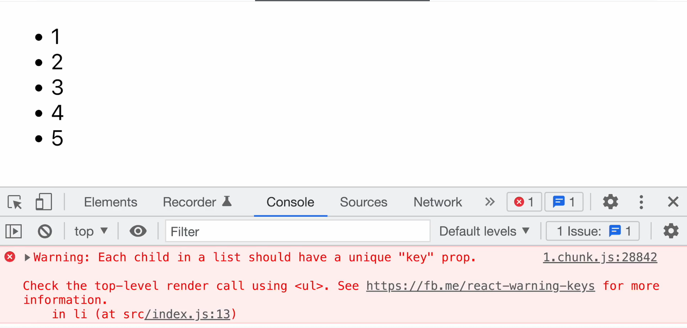
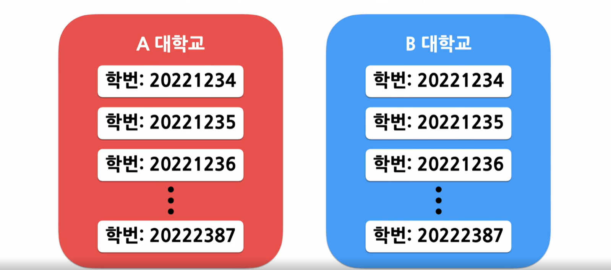
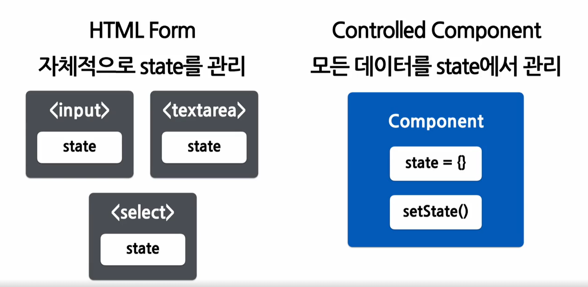
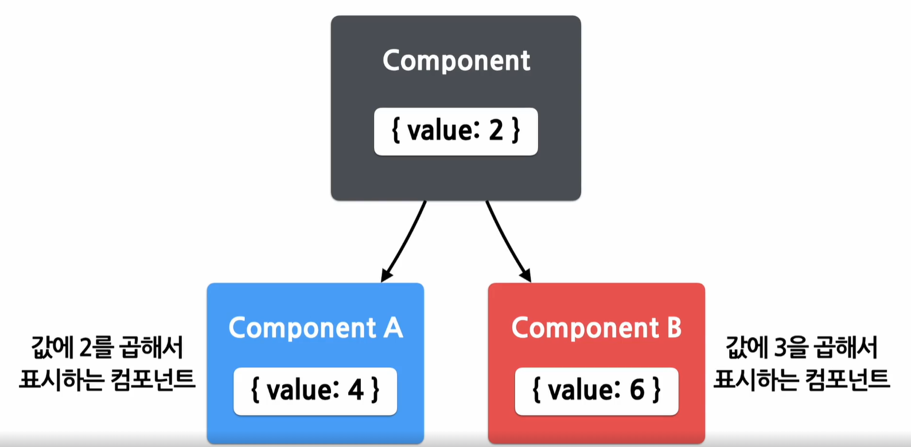
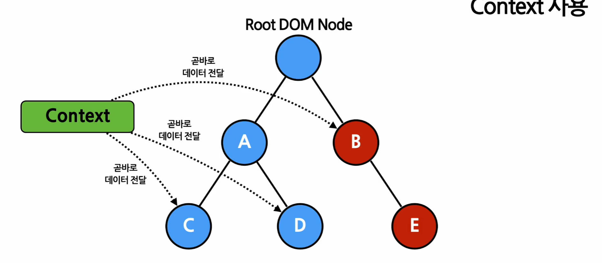

# 10강 List and Keys

## List와 Key

List란? : 같은 아이템을 순서대로 모아 놓은 것
Key란? : 각 객체나 아이템을 구분 할 수 있는 고유한 값

## 여러개의 Component 렌더링 하기

map()란? : mapping으로 한쪽에 있는 아이템과 다른 한쪽에 있는 아이템을 짝지어 준다

``` jsx
const doubled = numbers.map((number) => number * 2);
```

``` jsx
const numbers = [1, 2, 3, 4, 5];
const listItems = numbers.map((number) => 
    <li>{number}</li>
);

ReactDOM.render(
    <ul>{listItems}</ul>,
    document.getElementById('root')
);
```

기본적인 List Componenet

``` jsx
function NumberList(props) {
    const {numbers} = props;

    const listItems = numbers.map((number) =>
        <li>{number}</li>
    );

    return (
        <ul>{listItems}</ul>
    );
}

const numbers = [1, 2, 3, 4, 5];
ReactDOM.render(
    <NumberList numbers={numbers} />,
    document.getElementById('root')
);
```


+ 각 아이템에 고유한 키가 없기에 나오는 오류

## List의 Key

+ 리액트에서 키 값은 같은 리스트에 있는 엘리먼트 사이에서만 고유한 값이면 된다



key로 값을 사용하는 경우

``` jsx
const numbers = [1, 2, 3, 4, 5];
const listItems = numbers.map((number) =>
    <li ket = {number.toString()}>
        {number}
    </li>    
);
```

key로 id를 사용하는 경우

``` jsx
const todoItems = todos.map((todo) => 
    <li key {todo.id}>
        {todo.text}
    </li>    
);
```

key로 index를 사용하는 경우

``` jsx
const todoItems = todos.map((todo, index) =>
    // 아이템들의 고유힌 ID가 없을 경우에만 사용해야 함
    <li key = {index}>
        {todo.text}
    </li>
);
```

+ 배열에서 아이템의 순서가 바뀔 수 있는 경우에는 키 값으로 인덱스 사용 비추천


기억해야 할 점
+ map() 함수 안에 있는 Elements는 꼭 key가 필요하다


# 11강 forms

form란? : 사용자로부터 입력을 받기 위해 사용

HTML Form

``` jsx
<form>
    <label>
        이름 : 
            <input type="text" name = "name" />
     </label>       
     <button type="submit"> 제출 </button>
</form>
```

Controlled Components
+ 사용자가 입력한 값에 접근하고 제어할 수 있도록 해주는 컴포넌트



``` jsx
function NameForm(props) {
    const [value, setValue] = useState('');

    const handleChange = (event) => {
        setValue(event.target.value);
    }

    const handleSubmit = (event) => {
        alert('입력한 이름: ' + value);
        event.preventDefault();
    }

    return (
        <form onSubmit={handleSubmit}>
            <label>
                이름 : <input type="text" value={value} onChange={handleChange} />
            </label>
            <button type="submit">제출</button>
        </form>    
    )
}
```

모든 입력값을 대문자로 변경

``` jsx
const handleChange = (event) => {
    setValue(event.target.value.toUpperCase());
}
```

# 다양한 forms

Textarea 태그
+ 여러 줄에 걸쳐 긴 텍스트를 입력받기 위한 태그

``` jsx
function RequstForm(props) {
    const [value, setValue] = useState('요청사항을 입력하세요.');

    const handleChange = (event) => {
        setValue(event.target.value);
    }

    const handleSubmit = (event) => {
        alert('입력한 요청사항:' + value);
        event.preventDefault();
    }

    return(
        <form onSubmit={handleSubmit}>
            <label>
                요청사항 : <textarea value={value} onChange={handleChange} />
             </label>
             <button type="submit"> 제출 </button>
        </form>        
    )
}
```
select 태그
+ Drop-down 목록을 보여주기 위한 HTML 태그

``` jsx
function FruitSelect(props) {
    const [value, setValue] = useState('grape');

    const handleChange = (event) => {
        setValue(event.target.value);
    }

    const handleSubmit = (event) => {
        alert('선택한 과일: ' + value);
        event.preventDefault();
    }

    return(
        <form onSubmit={handleSubmit}>
            <label>
                과일을 선택하세요:
                <select value={value} onChange={handleChange}>
                    <option value="apple">사과</option>
                    <option value="banana">바나나</option>
                    <option value="grape">포도</option>
                    <option value="watermelon">수박</option>
                </select>
            </label>
            <button type="submit"> 제출 </button>
         </form>       
    )
}
```

``` jsx
<select multiple={true} value={['B', 'c']}>
```

File input 태그
+ 디바이스의 저장 장치로부터 하나 또는 여러 개의 파일을 선택할 수 있게 해주는 HTML 태그

# 12강 Lifting State Up

Shared State란? : 공유된 state
+ 어떤 컴포넌트의 스테이트에 있는 데이터를 여러 개의 하위 컴포넌트에서 공통적으로 사용하는 경우



## 하위 컴포넌트에서 State 공유하기

``` jsx
// 부모 컴포넌트
function Calculator(props) {
    const [temperature, setTemperature] = useState('');

    const handleChange = (event) => {
        setTemperature(event.target.value);
    }

    return (
        <fieldset>
            <legend>섭씨 온도를 입력하세요:</legend>
            <input
                value = {temperature}
                onChange={handleChange} />
            <BoilingVerdict
                celsius={parseFloat(temperature)} />
        </fieldset>
    )
}
```

``` jsx
// 자식 컴포넌트
function BoilingVerdict(props) {
    if(props.celsius >= 100){
        return <p>물이 끓습니다.</p>;
    }
    return <p> 물이 끓지 않습니다. </p>;
}
```


Lifting state up란? : 하위 컴포넌트의 state를 공통 상위 컴포넌트로 올리는 것

``` jsx
function Calculator(props) [
    const [temperature, setTemperature] = useState('');
    const [scale, setScale] = useState('c');
    
    const handleCelsiusChange = (temperature) => {
        setTemperature(temperature);
        setScale('c');
    }

    const handleFahrenheitChange = (temperature) => {
        setTemperature(temperature);
        setScale('f');
    }

    const celsius = scale === 'f' ? tryConvert(temperature, toCelsius) : temperature;
    const fahrenheit = scale === 'c' ? tryConvert(temperature, toFahrenheit) : temperature;

    return(
        <div>
            <TemperatureInput
                scale="c"
                temperature={celsius}
                onTemperatureChange={handleCelsiusChange} />
            
            <TemperatureInput
                scale="f"
                temperature={fahrenheit}
                onTemperatureChange={handleFahrenheitChange} />
            
            <BoilingVerdict
                celsius={parseFloat(celsius)} />
        </div>
    )
]
////////////////////////

function TemperatureInput(props){
    const handleChange = (event) => {
        props.onTemperatureChange(event.target.value);
    }

    return(
        <fieldset>
            <legend>
                온도를 입력해 주세요(단위: {scaleNames[props.scale]}):
            </legend>
                <input value={props.temperature} onChange={handleChange} />
        </fieldset>    
    )
}
```

# 13강 Composition vs Inheritance


Composition란? : 여러 개의 컴포넌트를 합쳐서 새로운 컴포넌트를 만드는 것


Containment란? : 하위 컴포넌트 합성, children 속성 사용

``` jsx 
function SplitPane(props) {
	return (
		<div classNmae="SpitPane">
            <div classNmae="SpitPane-left">
			    {props.left}
            </div>
            <div classNmae="SpitPane-right">    
			    {props.right}
            </div>    
		</div>
	);
}

function App(props) {
	return( 
        <SplitPane 
            left={<Contacts />   
            } 
            right={<Chat />} />
    );
}
``` 

Specialization란? : 전문화, 특수화, 범용적인 개념을 구별이 되게 구체화 하는것

``` jsx

function Dialog(props) {
	return (
		<FancyBorder>
			<h1>{props.title}</h1>
			<p>{props.message}</p>
		</FancyBorder>
	);
}

function WelcomdDialog(props) {
	return( 
    <Dialog title="어서 오세요"
     message="우리 사이트에 방문하신 것을 환영합니다." />
    );
}
```

컨테인먼트 + 스페셜라이제이션

``` jsx
function Dialog(props) {
	return (
		<FancyBorder color="blue">
			<h1 classNmae="Dialog-title">{props.title}</h1>
			<p classNmae="Dialog-message">{props.message}</p>
			{props.children}
		</FancyBorder>
	);
}

function SignUpDialog(props) {
	const [nickname, setNickname] = useState("");

	const handleChange = (event) => {
		setNickname(event.target.value);
	};

	const handleSignUp = () => {
		alert(`어서오세요, ${nickname}님!`);
	};

	return (
   <div>
        //  Specialization 
     <Dialog 
        title="화성 탐사 프로그램" 
        message="닉네임을 입력해 주세요.">

        // Containment
       <input value={nickname} onChange={handleChange} />
       <button onClick={handleSignUp}>가입하기</button>
     
     </Dialog>
   </div>
	);
}
```

Inheritance란? : 부모 클래스를 상속 받아서 새로운 자식 클래스를 만드는 개념


# 14강 Context

Context란? : 컴포넌트 트리를 통해 곧바로 컴포넌트로 전달하는 방식



+ 일일이 프롭스로 전달 할 필요 없이 데이터를 필요로 하는 컴포넌트에 바로 전달
+ 디버깅을 하기에 좋음


``` jsx
// 컨텍스트는 데이터를 매번 컴포넌트를 통해 전달할 필요 없이 컴포넌트 트리로 곧 바로 전달
// 여기에서는 현재 테마를 위한 컨텍스트를 생성하며, 기본값은 'light'이다.

const ThemeContext = React.createContext('light');

// Provider를 사용하여 하위 컴포넌트들에게 현재 테마 데이터를 전달합니다.
// 모든 하위 컴포넌트들은 컴포넌트 트리 하단에 얼마나 깊이 있는지에 관계없이 데이터를 읽을 수 있습니다.
// 현재 테마값으로 'dark'를 전달하고 있습니다.

function App(props){
    return(
        <ThemeContext.Provider value="dark">
            <Toobar/>
        <ThemeContext.Provider>   
    );
}
```

``` jsx 
// 이제 중간에 위치한 컴포넌트는 테마 데이터를 하위 컴포넌트로 전달할 필요가 없습니다.

function Toobar(props){
    return(
        <div>
            <ThemeButton />
        </div>
    );
}
```

``` jsx
function ThemeButton(props){
    // 리액트는 가장 가까운 상위 테마 Provider를 찾아서 해당되는 값을 사용한다.
    // 만약 해당되는 Provider가 없는 경우 기본값을 사용합니다.
    // 여기에서는 상위 Provider가 있기 때문에 현재 테마의 값은 'dark'입니다.

    return(
        <ThemeContext.Consumer>
            {value=> <Button theme={value} />}
        </ThemeContext.Consumer>    
    );
}
```

## Context API

Context 생성
``` jsx
const MyContext = React.createContext(기본값);
```


Provider 사용
``` jsx
<MyContext.Provider value={/* some value */}>
```

state를 사용하여 불필요한 재렌더링을 막음
``` jsx
function App(props){
    const [value, setValue] = useState({ something: 'something'});

    return(
        <MyContext.Provider value={value}>
            <Toolbar />
        </MyContext.Provider>    
    );
}
```

Provider 중첩 사용

``` jsx
// 테마를 위한 컨텍스트
const ThemeContext = React.createContext('light');

// 로그인 한 사용자를 위한 컨텍스트
const UserContext = React.createContext({
  name : 'Guest',
});

classNmae App extends React.Componenet {
    render() {
        const {signedInUser, theme} = this.props;

    return (
        <ThemeContext.Provider value={theme}>
            <UserContext.Provider value={signedInUser}>
                <Layout />
            <UserContext.Provider>
         </ThemeContext.Provider>       
        );
    }
}
```

UserContext() Hook을 사용한 예시
``` jsx
function Mycomponent(props) {
    const value = UserContext(Mycontext);

    return(
        ...
    )
}
```


