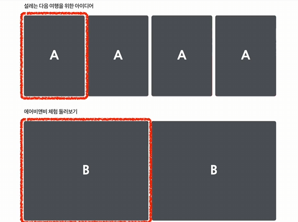
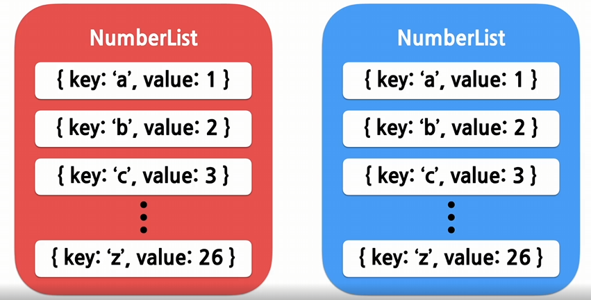
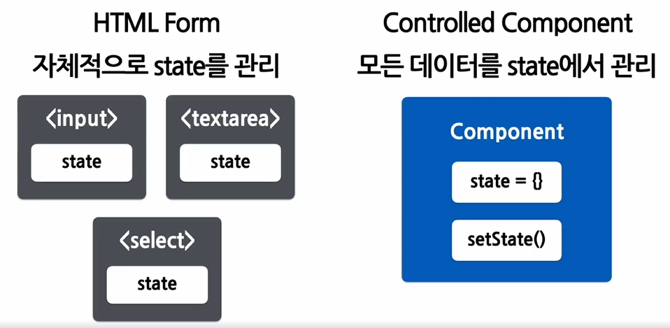
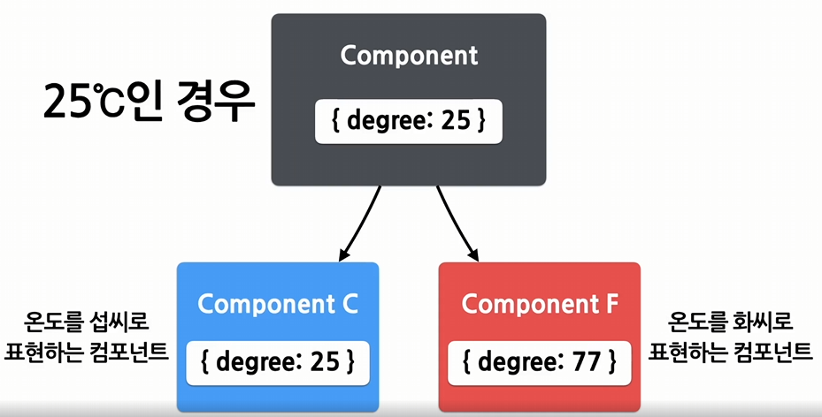
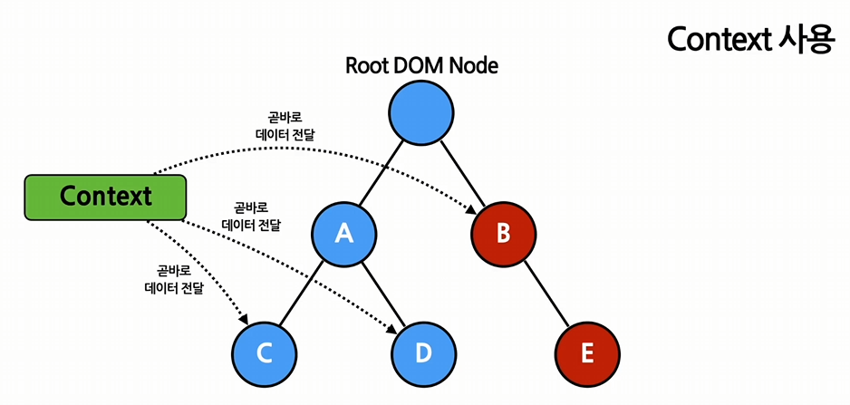

## 4주차 - List, Key, Forms, Lifting State Up, Composition vs Inheritance, Context

### #1 List와 Key

#### 1. List

- 같은 아이템을 순서대로 모아 놓은 것, 이를 위해 사용하는 자료구조가 배열
- 배열은 변수나 객체들을 하나의 변수로 묶어놓음

```jsx
const numbers = [1, 2, 3, 4, 5];
```

#### 2. Key

- 각 객체나 아이템을 구분할 수 있는 고유한 값
- React에서의 Key는 리스트에 존재하는 아이템들을 구분하기 위한 고유한 문자열을 의미함

#### 3. 여러개의 Component 렌더링 하기

- React에서는 배열과 키를 사용하여 반복되는 여러개의 컴포넌트들을 쉽게 렌더링 할 수 있음
  
  - a와 b 컴포넌트는 반복적으로 화면에 나타남.
  - 이때 컴포넌트를 하나씩 직접 넣는것은 비효율적
- 같은 컴포넌트를 여러개 출력하고자 할 때 `map`함수를 사용함

  - 배열에 들어가있는 각 변수에 처리를 한 뒤 리턴

  ```jsx
  const numbers = [1, 2, 3, 4, 5];

  const doubled = numbers.map((number) => number * 2);
  // numbers 배열에 들어가있는 각 숫자에 2를 곱한 값을 doubled에 배열로 리턴
  ```

- map 함수를 이용해 React에서 엘리먼트 렌더링하기

  ```jsx
  const numbers = [1, 2, 3, 4, 5];
  const listItems = numbers.map((number) =>
      <li>{number}</li>
  );

  ReactDOM.render(
      <ul>{listItems}</ul>
      document.getElementById('root')
  );

  // 최종적으로 렌더링되는 코드
  <ul>
      <li>1</li>
      <li>2</li>
      <li>3</li>
      <li>4</li>
      <li>5</li>
  </ul>
  ```

#### 4. List의 Key



- Key는 각 리스트 내에서 아이템을 구분하기 위한 용도이기 때문에 속해 있는 리스트 내에서만 고유한 값이면 됨.
- React에서 key값을 사용하는 방법

  ```jsx
  // id를 사용하는 방식
  const todoItems = todos.map((todo) => <li key={todo.id}>{todo.text}</li>);

  // index를 사용하는 방식
  const todoItems = todos.map((todo, index) => <li key={index}>{todo.text}</li>);
  ```

  - 리액트에서는 key를 명시적으로 넣어주지 않으면 기본적으로 index값을 key값으로 사용함
  - index를 key값으로 사용하는 것은 성능에 부정적인 영향을 끼칠 수 있어 id값을 사용하는 것이 좋음

---

### #2 Forms

#### 1. Form과 Controlled component

- Form
  - 회원가입이나 로그인같이 텍스트 입력, 체크박스 선택 등 사용자로부터 입력을 받기 위해 사용하는 것
- Contorlled Component

  - 사용자가 입력한 값에 접근하고 제어할 수 있도록 해주는 컴포넌트

  

  - HTML 폼에서는 각 엘리먼트가 자체적으로 스테이트를 관리
    - 자바스크립트 코드를 통해 각각의 값에 접근하기 쉽지 않음

- Contorlled Component에서는 모든 데이터를 state에서 관리

예시코드

```jsx
function NameForm(props) {
	const [value, setvalue] = useState("");

	const handleChange = (event) => {
		setValue(event.target.value);
	};

	const handleSubmit = (event) => {
		alert("입력한 이름 : " + value);
		event.preventDefault();
	};
	return (
		<form onSubmit={handleSubmit}>
			<label>
				이름 : <input type="text" value={value} onChange={handleChange} />
			</label>
			<button type="submit">제출</button>
		</form>
	);
}
```

---

### #3 Lifting State Up

- 여러개의 컴포넌트들 사이에서 state를 공유하는 방법
- Shared state

  - 어떤 컴포넌트의 스테이트에 있는 데이터를 여러개의 하위 컴포넌트에서 공통적으로 사용하는 경우
    
    - 자식 컴포넌트들이 각각 온도 값을 가지고 있을 필요 없이 부모 컴포넌트의 state에 있는 섭씨 온도값을 변환해서 표시해주면 됨.
  - 물이 끓는지 안 끓는지 확인하는 컴포넌트

    ```jsx
    function BoilingVerdict(props) {
      if (porps.celsius >= 100) {
        return <p>물이 끓습니다</p>;
      }
      return <p>물이 끓지 않습니다</p>;
    }

    function TemperatureInput(props) {
      const handleChange = (event) => {
        props.onTemperatureChange(event.target.value);
        // 사용자가 온도값을 변경할 때 마다 props에 있는 onTemperatureChange 함수를 통해
        // 변경된 온도값이 상위 컴포넌트로 전달됨.
      }

      return (
        <fieldset>
          <legend>섭씨 온도를 입력하세요 : </legend>
          <input value={props.temperature} onChange={handleChange} />
        </fieldset>
      )
    }

    function Calculator(props) {
      const [temperature, setTemperature] = useState('');

      const handleChange = (temperature) => {
        setTemperature(temperature);
      }

      return (
        <div>
          <TemperatureInput onTemperatureChange={handleChange} />
          <BoilingVerdict celsius={parseFloat(temperature)} />
          <!-- temperature값은 celsius라는 이름의 props로 전달됨 -->
        </div>
      )
    }
    ```

    - 각 컴포넌트가 state의 값을 갖고 있는 것이 아니라 공통된 상위 컴포넌트로 올려서 공유하는 방법을 사용하면 더욱 간결하고 효율적으로 개발이 가능함.

---

### #4 Composition vs Inheritance

#### 1. Composition

- 여러개의 컴포넌트를 합쳐서 새로운 컴포넌트를 만드는 것
- 컴포지션 방법 2가지

  1. Containment(컨테인먼트)

     - 하위 컴포넌트를 포함하는 형태의 합성 방법
     - 컴포넌트의 props에 기본적으로 들어있는 children 속성을 사용하면 됨.

       ```jsx
       function SplitPane(props) {
       	return (
       		<div>
       			<div>{props.left}</div>
       			<div>{props.right}</div>
       		</div>
       	);
       }

       function App(props) {
       	return <SplitPane left={<Contacts />} right={<Chat />} />;
       }
       ```

  2. Specialization(스페셜라이제이션)

     - 범용적으로 쓸 수 있는 컴포넌트를 만들어 놓고 이를 특수화 시켜서 컴포넌트를 사용하는 컴포지션 방법

     ```jsx
     function Dialog(props) {
     	return (
     		<FancyBorder>
     			<h1>{props.title}</h1>
     			<p>{props.message}</p>
     		</FancyBorder>
     	);
     }

     function WelcomdDialog(props) {
     	return <Dialog title="타이틀타이틀" message="메세지메세지" />;
     }
     ```

  3. 컨테인먼트와 스페셜라이제이션을 같이 사용하기

     - 다양하고 복잡한 컴포넌트를 효율적으로 개발할 수 있음

     ```jsx
     function Dialog(props) {
     	return (
     		<FancyBorder>
     			<h1>{props.title}</h1>
     			<p>{props.message}</p>
     			{props.children}
     		</FancyBorder>
     	);
     }

     function SignUpDialog(props) {
     	const [nickname, setNickname] = useState("");

     	const handleChange = (event) => {
     		setNickname(event.target.value);
     	};

     	const handleSignUp = () => {
     		alert("어서오세요");
     	};

     	return (
        <div>
          <!-- Specialization -->
          <Dialog title="타이틀" message="메세지">
            <!-- Containment -->
            <input value={nickname} onChange={handleChange} />
            <button onClick={handleSignUp}>가입하기</button>
            <!-- Containment -->
          </Dialog>
          <!-- Specialization -->
        </div>
     	);
     }
     ```

#### 2. Inheritance

- 부모 클래스를 상속받아 새로운 자식 클래스를 만드는 상속을 의미함.
- 컴포지션과 대비되는 개념
- 리액트에서는 상속보다는 컴포지션을 사용해서 개발하는 것이 더 좋음

---

### #5 Context

#### 1. Context란

- 리액트 컴포넌트들 사이에서 데이터를 기존의 props를 통해 전달하는 방식 대신<br>
  컴포넌트 트리를 통해 곧바로 컴포넌트를 전달하는 새로운 방식을 제공
- 이를 통해 어떤 컴포넌트든 데이터에 쉽게 접근할 수 있음
  
  - 만약 데이터를 전달하려는 컴포넌트가 10단계 밑에 있다면 10번이나 props를 타고 하위 컴포넌트로 내려가야함.
  - 이를 개선하기 위해 생긴 것이 Context
  - 일일이 props로 전달할 필요 없이 데이터를 필요로하는 컴포넌트에 곧바로 데이터를 전달할 수 있음
- 여러 컴포넌트에서 자주 필요로 하는 데이터
  - 로그인여부, 로그인 정보, UI테마, 현재 선택된 언어 등

예제 코드

```jsx
// 현재 테마를 위한 컨텍스트를 생성, 기본값은 light
const ThemeContext = React.createContext("light");
```

- ThemeContex 라는 이름의 컨텍스트를 생성

```jsx
// Provider를 사용하여 하위 컴포넌트들에게 현재 테마 데이터를 전달
function App(props) {
	return (
		<ThemeContext.provider value="dark">
			<Toolbar />
		</ThemeContext.provider>
	);
}

// 중간에 위치한 컴포넌트는 테마 데이터를 하위 컴포넌트로 전달 할 필요가 없음
function Toolbar(props) {
	return (
		<div>
			<ThemeButton />
		</div>
	);
}
```

- 최상위 컴포넌트인 app 컴포넌트를 ThemeContext.Provider로 감싸줌
- 이렇게하면 provider의 모든 하위 컴포넌트가 얼마나 깊이 위치해있는지 관계 없이 Context의 데이터를 읽을 수 있음

```jsx
// 리액트는 가장 가까운 상위 Provider를 찾아서 해당되는 값을 사용함
// 만약 해당되는 Provider가 없을 경우 기본값('light')를 사용함
// 상위 Provider로 'dark'를 지정했으므로 테마의 값은 'dark'
function ThemeButton(props) {
	return <ThemeContext.Consumer>{(value) => <Button theme={value} />}</ThemeContext.Consumer>;
}
```

- 단, 컴포넌트와 Context가 연동되면 재사용성이 떨어짐
- 그러므로 다른 레벨의 많은 컴포넌트가 데이터를 필요로 하는 경우가 아니라면 기존 방식(컴포지션)이 더 적합함

#### 2. Context API
- 컨텍스트 생성 `react.createContext()`
```jsx
const MyContext = React.createContext(기본값);
```
- 리액트 렌더링시 현재 컨텍스트의 값을 가장 가까이에 있는 상위 Provider로부터 받아오게됨.
- 상위 레벨에 매칭되는 Provider가 없다면 기본값 사용


- Provider
  - `context.Provider` 컴포넌트로 하위 컴포넌트들을 감싸주면 모든 하위 컴포넌트들이 해당 컨텍스트의 데이터에 접근할 수 있게 됨.
  ```jsx
  <MyContext.Provider value={}>
  ```
  - value라는 prop은 provider컴포넌트 하위에 있는 컴포넌트들에게 전달
  - 이렇게 전달한 value값이 변경되면 재렌더링됨

- 여러개의 컨텍스트를 동시에 사용하기
  ```jsx
  function Layout() {
    return (
      <div>
        <Sidebar/>
        <Content/>
      </div>
    );
  }

  function Content() {
    return(
      <ThemeContext.Consumer>
        {theme => (
          <UserContext.Consumer>
            {user => (
              <ProfilePage user={user} theme={theme}/>
            )}
          </UserContext.Consumer>
        )}
      </ThemeContext.Consumer>
    );
  }

  function App() {
    return (
      <ThemeContext.Provider value={theme}>
        <UserContext.Provider value={signedInUser}>
          <Layout/>
        </UserContext.Provider>
      </ThemeContext.Provider>
    );
  }
  ```
  - App 컴포넌트에서는 각 컨텍스트에 대해 2개의 Provider를 사용하여 자식 컴포넌트인 Layout을 감싸줌
  - 실제 컨텍스트의 데이터를 사용하는 Content 컴포넌트에서는 2ㅐ그이 컨슈머 컴포넌트를 사용하여 데이터를 전달하고 있음

- useContext() 사용하기
  - useContext Hook은 함수 컴포넌트에서 컨텍스트를 쉽게 사용할 수 있게 해줌
  ```jsx
  function MyComponent(props) {
    const value = useContext(MyContext);

    return(
      ...
    )
  }
  ```
  - 컨텍스트의 값을 다른 방식과 동일하게 컴포넌트 트리상에서 가장 가까운 상위 프로바이더로부터 받아오게 됨.
  - 컨텍스트의 값이 변경되면 변경된 값과 함께 useContext를 사용하는 컴포넌트가 재렌더링됨.