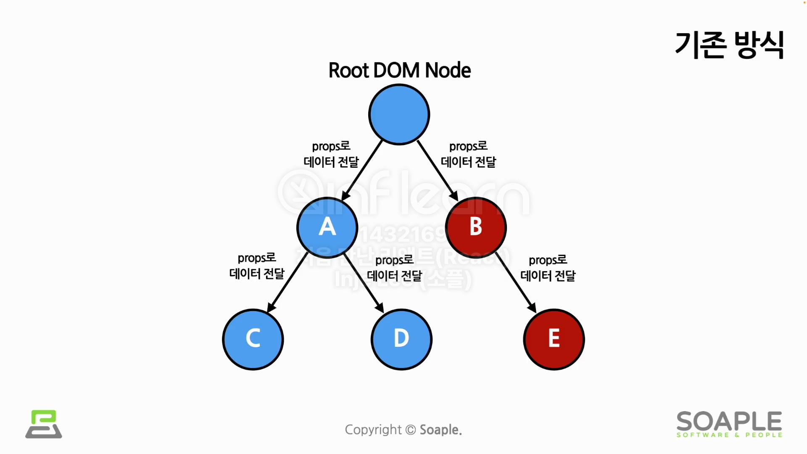
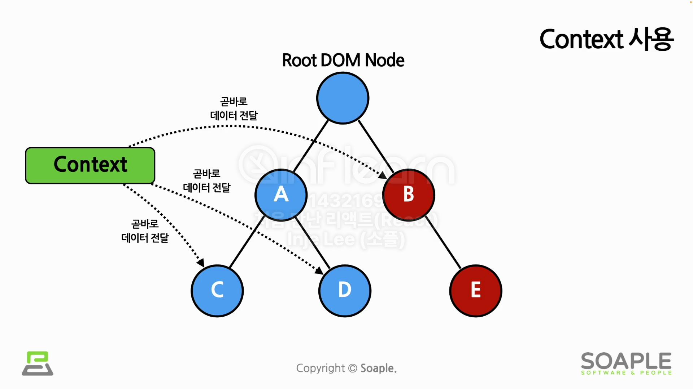

## 4주차 - List부터 Context까지
### #1 List와 Keys
**List**
- 같은 아이템을 순서대로 모아 놓은 것
- Array(배열)을 사용

**Key**
- 각 객체나 아이템을 구분할 수 있는 고유한 값
- 아이템들을 구분하기 위한 고유한 문자열
- 같은 LIst내에서만 고유한 값이면 됨

**여러 개의 Component 렌더링**
- 배열과 키를 사용하여 반복되는 여러 개의 Component들을 쉽게 렌더링함
- map()
  - 배열의 첫 번째 아이템부터 순서대로 각 아이템의 어떠한 연산을 수행한 뒤에 최종 결과를 배열로 리턴
  - 꼭 key값을 필요로 함 : 지정하지 않을 경우 index값으로 설정됨
- ```jsx
  // key 값을 id로 설정하는 경우
  const todoItems = todos.map((todo) =>
    <li key={todo.id}>
      {todo.text}
    </li>
  );
  
  // key 값을 index로 설정하는 경우, id가 없을 경우에만 사용
  const todoItems = todos.map((todo, index) =>
    <li key={index}>
      {todo.text}
    </li>
  );
  ```
  
***
### #2 Form
**Form**
- 사용자로부터 입력을 받기 위해 사용됨

**Controlled Components**
- HTML Form : 사용자가 입력한 값에 접근하기 어려움
  ```jsx
  <form>
    <label>
      이름:
      <input type="text" name="name" />
    </label>
    <button type="submit">제출</button>
  </form>
  ```
- Controlled Component : 입력한 값이 React의 통제를 받는 Input Form Element
- 사용자가 입력한 값을 직접적으로 제어할 수 있음 
  ```jsx
  function NameForm(props) {
    const [value, setValue] = useState('');
    
    const handleChange = (event) => {
      setValue(event.target.value);
    }
    
    const handleSubmit = (event) => {
      alert('입력한 이름: ' + value);
      event.preventDefault();
    }
    
    return (
      <form onSubmit={handleSubmit}>
        <label>
          이름:
          <input type="text" value={value} onChange={handleChange} />
        </label>
        <button type="submit">제출</button>
      </form>
    );
  }
  ```
**Form**의 종류
- Textarea
  - 여러 줄에 걸쳐 긴 텍스트를 입력받기 위한 HTML 태그
    ```jsx
    function NameForm(props) {
      const [value, setValue] = useState('요청사항을 입력하세요.');
    
      const handleChange = (event) => {
        setValue(event.target.value);
      }
    
      const handleSubmit = (event) => {
        alert('입력한 요청사항: ' + value);
        event.preventDefault();
      }
    
      return (
        <form onSubmit={handleSubmit}>
          <label>
            요청사항:
            <input type="text" value={value} onChange={handleChange} />
          </label>
          <button type="submit">제출</button>
        </form>
      );
    }
    ```
- Select
  - Drop-down 목록을 보여주기 위한 HTML 태그
    ```jsx
    function FruitSelect(props) {
      const [value, setValue] = useState('grage');
      // HTML 코드에선 selected라는 속성으로 초기값 설정
      
      const handleChange = (event) => {
        setValue(event.target.value);
      }
      
      const handleSubmit = (event) => {
        alert('선택한 과일: ' + value);
        event.preventDefault();
      }
      
      return (
        <form onSubmit={handleSubmit}>
          <label>
            과일을 선택하세요:
            <select value={value} onChange={handleChange}>
            // 여러 개의 옵션 선택 -> multiple={true} 속성 추가, value에 배열로 설정
              <option value="apple">사과</option>
              <option value="banan">바나나</option>
              <option value="grape">포도</option>
              <option value="watermelon">수박</option>
            </select>
          </label>
          <button type="submit">제출</button>
        </form>
      )
    }
    ```
- File Input
  - 디바이스의 저장 장치로부터 하나 또는 여러 개의 파일을 선택할 수 있게 해주는 HTML 태그
    ```jsx
    <input type="file" />
    ```
  - 읽기 전용이기 때문에 Uncontrolled Component
  
- 하나의 컴퍼넌트에서 여러 개의 입력을 다루는 경우
  - 여러 개의 state를 선언하여 각각의 입력에 대해 사용
    ```jsx
    function Reservation(props) {
      const [haveBreakfast, setHaveBreakfast] = useState(true);
      const [numberOfGeust, setNumberOfGuest] = useState(2);
      
      const handleSubmit = (event) => {
        alert(`아침식사 여부: ${haveBreakfast}, 방문객 수: ${numberOfGuest}`);
        event.preventDefault();
      }
      
      return (
        <form onSubmit-{handleSubmit}>
          <label>
            아침식사 여부:
            <input
              type="checkbox"
              checked={haveBreakfast}
              onChange={(event) => {
                setHaveBreakfast(event.target.checked);
              }} />
          </label>
          <br />
          <label>
            방문객 수:
            <input
              type="number"
              value={numberOfGeust}
              onChange={(event) => {
                setNumberOfGuest(event.target.value);
              }} />
          </label>
          <button type="submit">제출</button>
        </form>
      );
    }
    ```
  


***
### #3 Lifting State Up


**Shared State**
- 자식 컴포넌트들이 가장 가까운 공통된 부모 컴포넌트의 state를 공유해서 사용
- State에 있는 데이터를 여러 개의 하위 컴포넌트에서 공통적으로 사용하는 경우
- 예시코드
  ```jsx
  function BoilingVerdict(props) {
    if(props.celsius >= 100) {
      return <p>물이 끓습니다. </p>;
    }
    return <p>물이 끓지 않습니다. </p>;
  }
  
  const scaleNames = {
    c: '섭씨',
    f: '화씨'
  };
  
  function TemperatureInput(props) {
    const handleChange = (event) => {
      props.onTemperatureChange(event.target.value);
    }
    
    return (
      <fieldset>
        <legend>
          온도를 입력해 주세요(단위: {scaleNames[props.scale]});
        </legend>
        <input
          value={props.temperature}
          onChange={handleChange} />
      </fieldset>
    )
  }
  
  function Calculator(props) {
    const [temperature, setTemperature] = useState('');
    const [scale, setScale] = useState('c');
    
    const handleCelsiusChange = (temperature) => {
      setTemperature(temperature);
      setScale('c');
    }
    
    const handleFahrenheitChange = (temperature) => {
      setTemperature(temperature);
      setScale('f');
    }
    
    const celsius = scale === 'f' ? tryConvert(temperature, toCelsius) : temperature;
    const fahrenheit = scale === 'c' ? tryConvert(temperature, toFahrenheit) : temperature;
    
    return(
      <div>
        <TemperatureInput 
          scale="c"
          temperature={celsius}
          onTemperatureChange={handleCelsiusChange} />
        <TemperatureInput 
          scale="f" 
          temperature={fahrenheit}
          onTemperatureChange={handleFahrenheitChange} />
        <BoilingVerdict
          celsius={parseFloat(celsius)} />
      </div>
    );
  }
  
  function toCelsius(fahrenheit) {
    return (fahrenheit - 32) * 5 / 9;
  }
  function toFahrenheit(celsius) {
    return (celsius * 9 / 5) +32;
  }
  
  function tryConvert(temperature, convert) {
    const input = parseFloat(temperature);
    if(Number.isNaN(input)) {
      return '';
    }
    const output = convert(input);
    const rounded = Math.round(output * 1000) / 1000;
    return rounded.toString();
  }
  ```

***
### #4 Composition vs Inheritance

**Composition**
- 여러 개의 컴포넌트를 합쳐서 새로운 컴포넌트를 만드는 것

**Composition의 사용기법**
1. Containment
  - 하위 컴포넌트를 포함하는 형태의 합성 방법
  ```jsx
  function FancyBorder(props) {
    return (
      <div className={'FancyBorder FancyBorder-' + props.color}>
        {props.children}
      </div>
    );
  }
  
  function WelcomeDialog(props) {
    return (
      <FancyBorder color="blue">
        <h1 className="Dialog-title">
          어서오세요
        </h1>
        <p className="Dialog-message">
          우리 사이트에 방문하신 것을 환영합니다!
        </p>
      </FancyBorder>
    );
  }
  ```
2. Specialization
  - 특별화, 전문화
  - 범용적인 개념을 구별이 되게 구체화 하는 것
  - 범용적인 컴포넌트를 만들어 놓고 이를 특수화 시켜서 컴포넌트를 사용하는 컴포지션 방법
  ```jsx
  function Dialog(props) {
    return (
      <FancyBorder color="blue">
        <h1 className="Dialog-title">
          {props.title}
        </h1>
        <p className="Dialog-message">
          {props.message}
        </p>
      </FancyBorder>
    );
  }
  
  function WelcomeDialog(props) {
    return (
      <Dialog
        title = "어서오세요"
        mesaage = "우리 사이트에 방문하신 것을 환영합니다!"
      />
    );
  }
  ```
3. Containment와 Specialization 같이 사용하기
  ```jsx
  function Dialog(props) {
    return (
      <FancyBorder color="blue">
        <h1 className="Dialog-title">
          {props.title}
        </h1>
        <p className="Dialog-message">
          {props.message}
        </p>
        {props.children}
      </FancyBorder>
    );
  }
  
  function SignUpDialog(props) {
  // 중간생략
    return (
      <Dialog
        title="화성 탐사 프로그램"
        message="닉네임을 입력해 주세요">
        <input
          value={nickname}
          onChange={handleChange} />
        <button onClick={handleSignUp}>
          가입하기
        </button>
      </Dialog>
    );
  }
  ```
  
**Inheritance**
- 다른 컴포넌트로부터 상속을 받아서 새로운 컴포넌트를 만드는 것
- 실용적인 사용예시 없음


***
### #5 Context
**Context**
- 컴포넌트 간의 데이터 전달에서 한 컴포넌트에서 데이터를 컴포넌트 트리를 통해 곧바로 다른 컴포넌트로 전달하는 방식



```jsx
const ThemeContext = React.createContext('light');

function App(props) {
  return (
    <ThemeContext.Provider value="dark">
      <Toolbar />
    </ThemeContext.Provider>
  );
}

function Toolbar(props) {
  return (
    <div>
      <ThemedButton />
    </div>
  );
}
  
function ThemedButton(props) {
  return (
    <ThemeContext.Consumer>
      {value => <Button theme={value} />}
    </ThemeContext.Consumer>
  );
}
```
**Context API**
1. **React.createContext()**
  - Context 생성
  - ```jsx
    const MyContext = React.createContext(기본값);
    ```
2. **Context.Provider**
  - 컨텍스트로 데이터를 제공해주는 컴포넌트
  - ```jsx
    <MyContext.Provider value={/* some value */}>
    ```
  - Provider 컴포넌트의 하위 컴포넌트들은 Provider가 제공한 데이터들을 사용하고 있고 이들을 consumer 컴포넌트라 부름
  - consumer component들은 provider의 value prop이 바뀔 때마다 재렌더링 됨
  - provider component가 재렌더링 될 때마다 모든 하위 consumer 컴포넌트가 재렌더링 됨
    - state를 사용하여 불필요한 재렌더링을 막을 수 있음
    ```jsx
    function App(props) {
      const [value, setValue] = useState({ somthing: 'something' });
      
      return (
        <MyContext.Provider value={value}>
          <Toolbar />
        </MyContext.Provider>
      );
    }
    ```
3. **Context.Consumer**
  - 컨텍스트의 데이터를 구독하는 컴포넌트
  - ```jsx
    <MyContext.Consumer>
      {value => /* 컨텍스트의 값에 따라서 컴포넌트들을 렌더링 */}
    </MyContext.Consumer>
    ```
  - function as a child
    - 컴포넌트의 자식으로 함수를 사용하는 방법
    - ```jsx
      // children이라는 props를 직접 선언하는 방식
      <Profile children={name => <p>이름: {name}</p>} />
      
      // Profile컴포넌트로 감싸서 children으로 만드는 방식
      <Profile>{name => <p>이름: {name}</p>}</Profile>
      ```
4. Context.displayName
  - Context가 가진 문자열 속성
  - 컨텍스트마다 이름처럼 문자열을 부여해줄 수 있음

5. useContext() 훅
  - ```jsx
    function MyComponent(props) {
      const value = useContext(MyContext);
      
      return (
        ...
      )
    }
    ```

