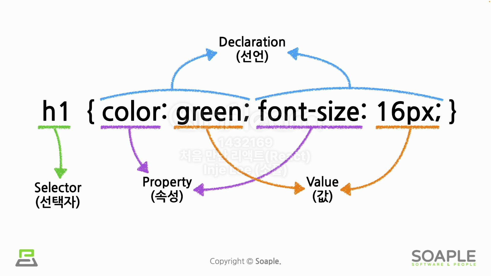
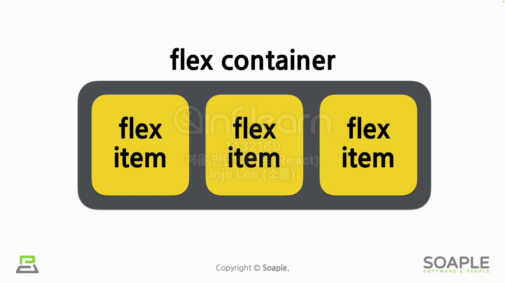
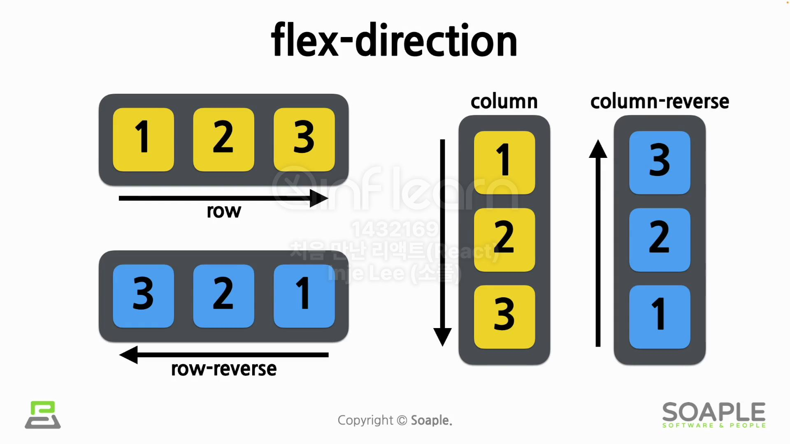
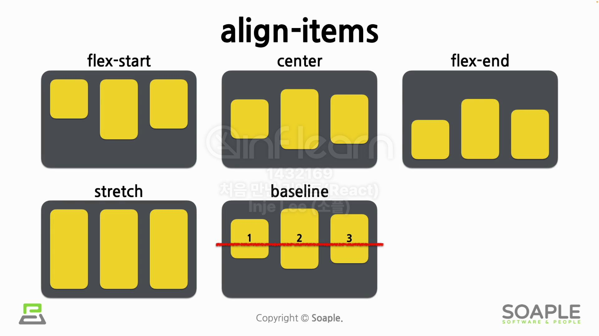
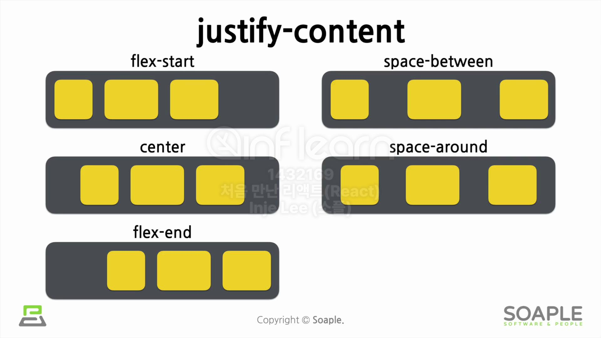

## 5주차 - Styling
### #1 CSS와 Selector
**CSS**
- Cascading Style Sheets
- 스타일링을 위한 일종의 언어
- 하나의 엘리먼트가 여러 개의 스타일 규칙들을 만족할 시에 계단을 내려가는 것처럼 스타일들이 우선순위를 가지고 적용됨

**Selector**
- 엘리먼트에 스타일이 적용되는 규칙
- 스타일을 어떤 엘리먼트에 적용시킬 지 선택하게 해주는 역할



**Selector**의 유형
- Element selector
  - HTML 태그의 이름
  - ```css
    h1 {
      color: green;
    }
    ```
- ID selector
  - HTML에서 정한 엘리먼트의 ID
  - ID는 엘리먼트들끼리 중복될 수 없음
  - ```css
    #section {
      background-color: black;
    }
    ```
- Class selector
  - 클래스는 여러 개의 엘리먼트들을 분류하고 묶음
  - ```css
    .medium {
      font-size: 20px;
    }
    p.medium {
      font-size: 20px;
    }
    ```
- Universal selector
  - 특정 엘리먼트가 아닌 전체 엘리먼트에 적용
  - ```css
    * {
      font-size: 20px;
      color: blue;
    }
    ```
- Grouping selector
  - 똑같은 스타일들을 여러 셀렉터에 적용할 때 그룹으로 묶어서 사용
  - ```css
    h1, h2, p {
      color: black;
      text-align: center;
    }
    ```
- Element의 상태와 관련된 selector
  - :hover  
    마우스 커서가 element 위에 올라왔을 때
  - :active  
    element가 클릭됐을 떄 (a태그에 주로 사용)
  - :focus  
    element가 초점을 갖고 있을 경우 (input태그에 주로 사용)
  - :checked  
    radio button이나 checkbox 같은 유형의 input태그가 체크되어 있는 경우
  - :first-child, :last-child
    상위 element를 기준으로 각각 첫 번째 child, 마지막 child일 경우
  - ```css
    button:hover {
      font-weight: bold;
    }
    ```

  
***
### #2 Layout 관련 속성
**display**
- 엘리먼트를 화면에 어떻게 표시할지에 대한 방법
  ```css
  div {
    display: none | block | inline | flex;
  }
  ```

- display: block;
  - 블록 단위로 element를 배치
  - p, div, h1 ~ h6 태그의 display 속성 기본 값
- display: inline;
  - element를 라인 안에 넣는 것
  - span 태그의 display 속성 기본값
- display: flex;
  - element를 블록 레벨의 flex container로 표시
  - container이기 때문에 내부에 다른 element들을 포함

**visibility**
- 엘리먼트를 화면에 보여주거나 감추기 위해 사용
  ```css
  div {
    visibility: visible | hidden;
  }
  ```
- visibility: visible;
  - element를 화면에 보이게 하는 것
- visibility: hidden;
  - 화면에서 안 보이게 감추는 것
  - element를 안 보이게만 하고 화면에서의 영역은 그대로 차지

**position**
- 엘리먼트를 어떻게 위치시킬 것인지 정의
  ```css
  div {
    position: static | fixed | relative | absolute;
  }
  ```
- dlsplay: none;
  - element를 숨기기 위해 사용
  - script 태그의 display 속성 기본값
- position: static;
  - 기본값으로 element를 원래의 순서대로 위치시킴
- position: fixed;
  - element를 브라우저 window에 상대적으로 위치시킴
- position: relative;
  - element를 보통의 위치에 상대적으로 위치시킴
- position: absolute;
  - element를 절대 위치에 위치시킴

**가로, 세로 길이와 관련된 속성**
- ```css
  div {
    width: auto | value;
    height: auto | value;
    min-width: auto | value;
    min-height: auto | value;
    max-width: auto | value;
    max-height: auto | value;
  ```

**Flexbox**  
- 
  ```css
  div {
    display: flex;
    flex-direction: row | column | row-reverse | column-reverse;
    align-items: stretch | flex-start | center | flex-end | baseline;
    justify-content: flex-start | center | flex-end | space-between | space-around;
  }
  ```
- flex-direction  
    
  

- align-items
  - cross axis를 기준으로 함  
  

- justify-content
  - main axis를 기준으로 함  
  


***

### #3 Font 관련 속성과 기타 속성들

**font 관련 속성**
```css
#title {
  font-family: "사용할 글꼴 이름", <일반적인 글꼴 분류>;
  font-size: value;
  font-weight: normal | bold;
  font-style: normal | italic | oblique;
}
```
- font-family
  ```css
  #title1 {
    font-family: "Times New Roman", Times, serif;
  }
  ```
  - 일반적인 글꼴 분류
    serif, sans-serif, monospace, cursive, fantasy 등이 있음
- font-size
  - px, em, rem, vw 등의 단위를 사용할 수 있음
- font-weight
  - normal, bold, 100 ~ 900의 100 단위 숫자
- font-style
  - normal
  - italic
    - 글자가 기울어진 형태로 나타남
    - 별도로 기울어진 형태의 글자들을 직접 디자인해서 만든 것
      - 따라서 이탤릭체를 지원하지 않는 글꼴도 있음
  - oblique
    - 그냥 글자 자체를 기울인 것


**기타 속성들**

- CSS의 색상 값
  - 16진수 컬러 값: #ff0000
  - 투명도를 가진 16진수 컬러 값: #ff000055
  - RGB 컬러 값: rgb(255, 0, 0)
  - RGBA 컬러 값: rgba(255, 0, 0, 0.5)
  - HSL 컬러 값: hsl(120, 100%, 25%)
  - HSLA 컬러 값: hsla(120, 2..%, 50%, 0.3)
  - 미리 정의된 색상의 이름: red
  - currentcolor 키워드: 현재 지정된색상 값을 사용
- background-color
  ```css
  div {
    background-color: color | transparent;
  }
  ```
- border
  ```css
  div {
    border: border-width border-style border-color;
  }
  ```
  
***
### #4 styled-components

**styled-components** 설치
```
#npm을 사용하는 경우
npm install --save styled-components

#yarn을 사용하는 경우
yarn add styled-components
```

**styled-components** 기본 사용법
- tagged template literal
  ```jsx
  const name = '인제';
  const region = '서울';
  
  function myTagFunction(strings, nameExp, regionExp) {
    let str0 = strings[0];
    let str1 = strings[1];
    let str2 = strings[2];
    
    return `${str0}${nameExp}${str1}${regionExp}${str2}`;
  }
  
  const output = myTagFunction`제 이름은 ${name}이고, 사는 곳은 ${region}입니다.`;


  console.log(output);
  ```
  
- styled-components 사용 예시
  ```jsx
  import styled from "styled-components";
  
  const Wrapper = styled.div`
    padding: 1em;
    background: grey;
  `;
  ```
- styled-components의 props 사용하기
  ```jsx
  const Button = styled.button`
    color: ${props => props.dark ? "white" : "dark"};
    background: ${props => props.dark ? "black" : "white"};
  `;
  
  function Sample(props) {
    return (
      <div>
        <Button>Normal</Button>
        <Button dark>Dark</Button>
      </div>
    )
  }
  ```
- styled-components의 스타일 확장하기
  ```jsx
  const Button = styled,button`
    color: grey;
    border: 2px solid palevioletred;
  `;
  
  const RoundedButton - styled(Button)`
    border-radius: 16px;
  `;
  
  function Sample(props) {
    return (
      <div>
        <Button>Normal</Button>
        <RoundedButton>Rounded</RoundedButton>
      </div>
    );
  }
  ```
