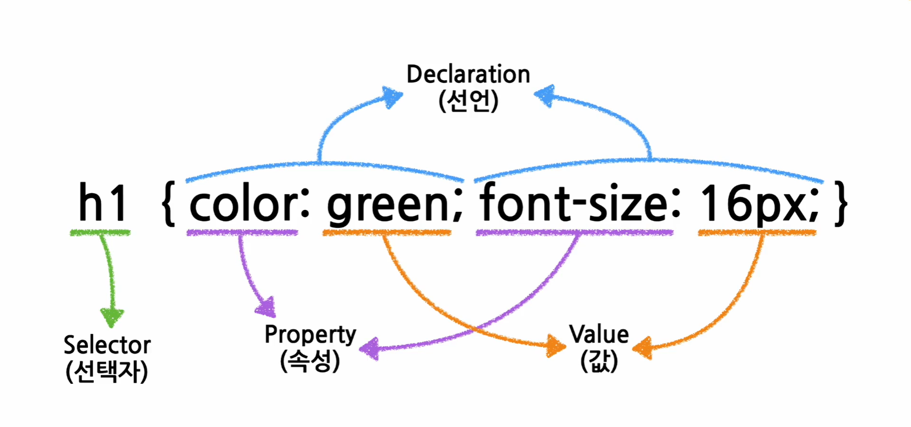

# 15강 Styling

CSS: Cascading Style Sheets



Selector의 유형

+ Element selector
``` jsx
h1 {color: green;}
```

+ ID selector
``` jsx
<div id="section"> ... </div>

#section {background-color:black;}
```

+ Class selector
``` jsx 
<div class="section"> ... </div>
.section {background-color:black;}
```

+ Universal selector
``` jsx
 * {font-size: 20px; color: blue;}
 ```

+ Grouping selector
``` jsx
h1, h2, p {
    color: black;
    text-align: center; 
}
```

+ 상태와 관련된 selector 
:hover - 마우스 커서가 element 위에 올라왔을 때
:active - 주로 <a>태그(link)에 사용되는데, element가 클릭됐을 때를 의미
:focus - 주로 <input> 태그에서 사용되는데, element가 초점을 갖고 있을 경우를 의미
:checked - radio button 이나 checkbox  같은 유형의 <input> 태그가 체크되어 있는 경우를 의미
:first-child, :last-child - 상위 element를 기준으로 각각 첫 번째 child, 마지막 child일 경우를 의미 

## 레이아웃과 관련된 CSS 속성

:display - none | block | inline | flex

+ display: none;
  + element를 화면에서 숨기기 위해 사용
  + <script> 태그의 display 속성 기본값은 display: none;
 
+ display: block;
  + 블록 단위로 element를 배치
  + ``` jsx <p>, <div>, <h1> ~ <h6> ``` 태그의 display 속성 기본값이 display:block;

+ display: inline;
  + element를 라인 안에 넣는 것.
  + <span> 태그의 display 속성 기본값이 display: inline;

+ display: flex;
  + element를 블록 레벌의 flex container로 표시
  + container이기 때문에 내부에 다른 element들을 포함


visibility 속성
``` jsx  div{ visibility: visible | hidden;} ```

visibility 속성의 대표적인 값들
+ visibility: visible;
  + element를 화면에 보이게 하는 것

+ visibility: hidden;
  + 화면에서 안 보이게 감추는 것
  + element를 안보이게만 하는 것이고, 화면에서의 영역은 그대로 차지


position 속성
``` jsx div { position: static | fixed | relative | absolute;} ```

+ static
  + 기본 값으로 element를 원래 순서대로 위치시킴

+ fixed
  + element를 브라우저 window에 상대적으로 위치시킴

+ relative
  + element를 보통의 위치에 상대적으로 위치시킴

+ absolute
  + element를 절대 위치에 위치시킴


Flexbox 속성

``` jsx
div { display: flex;
      flex-direction: row | column | row-reverse | column-reverse;
      align-items: stretch | flex-start | center | flex-end | baseline;
      justify-content: flex-start | center | flex-end | space-between | space-around;
}
```
flex-direction 속성
+ row
    + 기본값이며 아이템을 행(row)을 따라 가로 순서대로 왼쪽부터 배치

+ column
  + 아이템을 열(column)을 따라 세로부터 순서대로 위쭉부터 배치

+ row-reverse
  + 아이템을 행(row)의 역(reverse)방향으로 오른쪽부터 배치

+ column-reverse
  + 아이템을 열(column)의 역(reverse)방향으로 아래쪽부터 배치


 align-items 속성 cross axis를 기준으로 

+ stretch
  + 기본값으로써 아이템을 늘려서(stretch) 컨테이너를 가득 채움

+ flex-start
  + cross axis의 시작 지점으로 아이템을 정렬

+ center
  + cross axis의 중앙으로 아이템을 정렬

+ flex-end
  + cross axis의 끝 지점으로 아이템을 정렬

+ baseline
  + 아이템을 baseline 기준으로 정렬
  

justify-content 속성 main axis를 기준으로

+ flex-start
  + main axis의 시작 지점으로 아이템을 맞춤

+ center
  + main axis의 중앙으로 아이템을 맞춤

+ flex-end
  + main axis의 끝 지점으로 아이템을 맞춤

+ space-between
  + main axis를 기준으로 첫 아이템은 시작 지점에 맞추고 마지막 아이템은 끝 지점에 맞추며,
   중간에 있는 아이템들 사이(between)의 간격(space)이 일정하게 되도록 맞춤

+ space-around
  + main axis를 기준으로 각 아이템의 주변(around) 간격(space)을 동일하게 맞춤


# Font와 관련된 CSS 속성, 기타 많이 사용하는 CSS 속성

font와 관련된 대표적인 속성

``` jsx
#title {
  font-family: "사용할 글꼴";
  font-size: value;  // 1m = 16px
  font-weight: normal | bold;
  font-Style: normal | italic | obliuue;
} 
```


# Styled-components

+ template literal
  + Untagged template literal
  + Tagged template literal

``` jsx
//  Untagged template literal
// 단순한 문자열
` string text`

// 여러 줄(Multi-line)에 걸친 문자열
` string text line1
  string text line2 `

//  대체 가능한 expression이 들어있는 문자열
` string text${expression}  string text`

// Tagged template literal
// myFunction의 파라미터로 expression으로 구분된 문자열 배열과 expression이 순서대로 들어간 형태로 호출
myFunction `string text ${expression} string text`;
```

Style-components 사용 예시

``` jsx
import React from "react";
import styled from "styled-components";

const Wrapper = styled.div`
    padding: 1em;
    background: grey;
    `;
```

styled-components 확장

``` jsx
import React from "react";
import styled from "styled-components";

// Button 컴포넌트
const Button = styled.button`
    color: grey;
    border: 2px solid palevioletred;
    `;

// Button에 style이 추가된 RoundedButton 
const RoundedButton = styled(Button)`
    border-radius: 16px`;

function Sample(props) {
  return (
    <div>
        <Button>Normal</Button>
        <RoundedButton>Rounded</RoundedButton>
    </div>
  )
}
```

# 17강 Appendix A. 리액트 버전 18

## Automatic Batching

Automatic Batching란? : 여러가지 작업을 한번에 처리하는 것

``` jsx
// 기존 버전
setTimeout(() => {
  setCount((count) => count + 1);
  setIsFull((isFull) => !isFull);
  // 각 state의 업데이트마다 재렌더링이 발생
}, 1000)

// 현재 버전
setTimeout(()=> {
  setCount((count) => count + 1);
  setIsFull((isFull) => !isFull);
  // 재렌더링이 마지막에 한 번만 발생 (Automatic Batching)
}, 1000);
```

## Transitions
+ 긴급한 업데이트와 긴급하지 않은 업데이트를 구분해서 처리하기 위한 개념

업데이트의 종류
+ 긴급한 업데이트
  + 사용자와 직접적인 인터랙션이 일어나는 경우
  + 글자입력, 버튼 클릭 등

+ 긴급하지 않은 업데이트
  + 사용자와 직접적인 인터랙션이 일어나지 않는 경우
  + 서버로부터 결과를 받아어솨 보여주는 경우

``` jsx

import { startTransition } from "react";

// 긴급 업데이트 : 입력한 글자를 화면에 보여주어야 함

setInputValue(input);

// 함수 내에 있는 모든 업데이트는 Transition 업데이트가 됨
startTransition(() => {
  //Transition 업데이트: 검색 결과를 보여주어야 함
  setSearchQuery(input);
});
```

## Suspense

+ 하위 컴포넌트가(children)가 준비되기 전까지 렌더링을 중단하는 것

``` jsx

import { lazy, Suspense } from "react";
import LoadingSpinner from './LodingSpinner';

const OtherComponent = lazy(() => import('./OtherComponent'));

function MyComponent(props){
  return(
    <Suspense fallback = {< LoadingSpinner />}>
      <OtherComponent />
    </Suspense>
  );
}
```

+ Other 컴포넌트가 준비되기 전까지 Fallback 속성에 들어간 LoadingSpinner를 보여줌


## 클라이언트와 서버 렌더링 API 업데이트


리액트 DOM 서버
+ renderToPipeablStream
  + NodeJS 환경에서 스트리밍을 위한 함수

+ renderToReadableStream
  + Edge runtime 환경 (Deno, Cloudflare workers)을 위한 함수


## 새롭게 추가된 훅들

+ useId()
  + 서버와 클라이언트에서 고유한 id값을 생성하기 위한 훅

+ useTransitios()
  + 긴급하지 않으 업데이트를 위한 훅

+ useDeferredValue()
  + 긴급하지 않은  업데이트를 재렌더링하는 것을 연기하는 훅

+ useSyncExternalStore()
  + 외부 저장소를 구독 할 수 있게 해주는 훅
  + 외부 저장소를 React 컴포넌트의 state와 연동해서 사용하고 싶을때 사용

+ useInsertionEffect()
  + CSS in JS 라이브러리를 위한 훅


